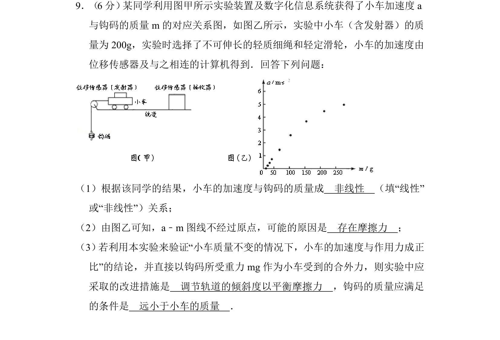
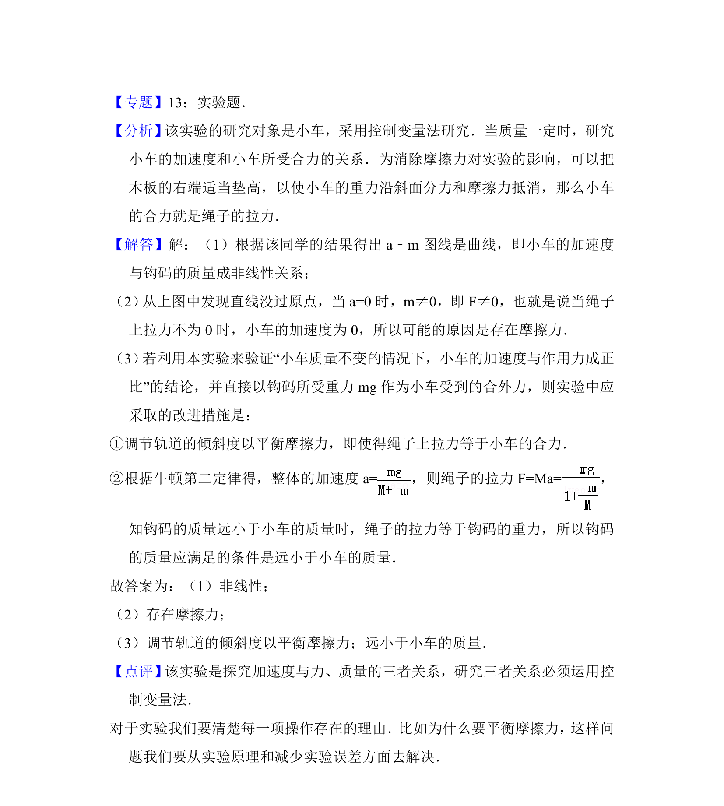

## 题面

## 摘要

探究加速度与钩码质量关系的实验，分析图线非线性及不过原点的原因，并提出改进措施及条件。

## 关联考点

- [[探究加速度与力]]
- [[质量的关系]]
- [[856-平衡摩擦力|平衡摩擦力]]
- [[104-物理实验-控制变量法|控制变量法]]
- [[583-实验条件|实验条件]]

## 答案与解析

> 📄 原 PDF 第 11 页：`素材/真题/湖南/2008-2024·（湖南）物理高考真题/2014年高考物理试卷（新课标Ⅰ）（解析卷）.pdf`

<!-- 题干文本-start -->
## 题干文本
9．（6分） 某同学利用图甲所示实验装置及数字化信息系统获得了小车加速度a
与钩码的质量m的对应关系图，如图乙所示，实验中小车（含发射器）的质
量为200g，实验时选择了不可伸长的轻质细绳和轻定滑轮，小车的加速度由
位移传感器及与之相连的计算机得到．回答下列问题：
（1）根据该同学的结果，小车的加速度与钩码的质量成　非线性　（填“线性”
或“非线性”）关系；
（2）由图乙可知，a﹣m图线不经过原点，可能的原因是　存在摩擦力　；
（3） 若利用本实验来验证“小车质量不变的情况下，小车的加速度与作用力成正
比”的结论，并直接以钩码所受重力mg作为小车受到的合外力，则实验中应
采取的改进措施是　调节轨道的倾斜度以平衡摩擦力　，钩码的质量应满足
的条件是　远小于小车的质量　．
<!-- 题干文本-end -->

<!-- 解析文本-start -->
## 解析文本
【考点】M8：探究加速度与物体质量、物体受力的关系．菁优网版权所有
<!-- 解析文本-end -->
