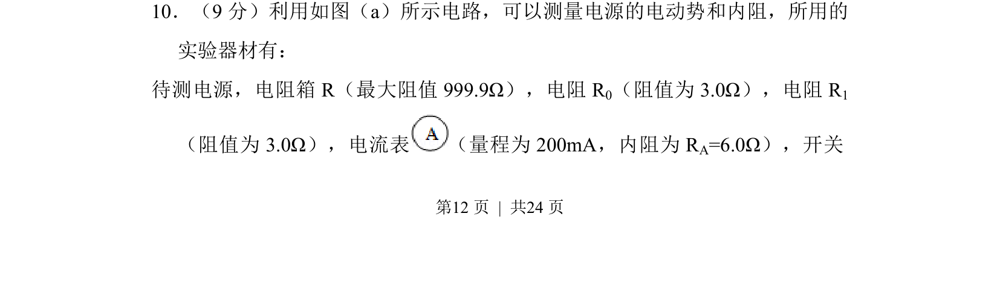
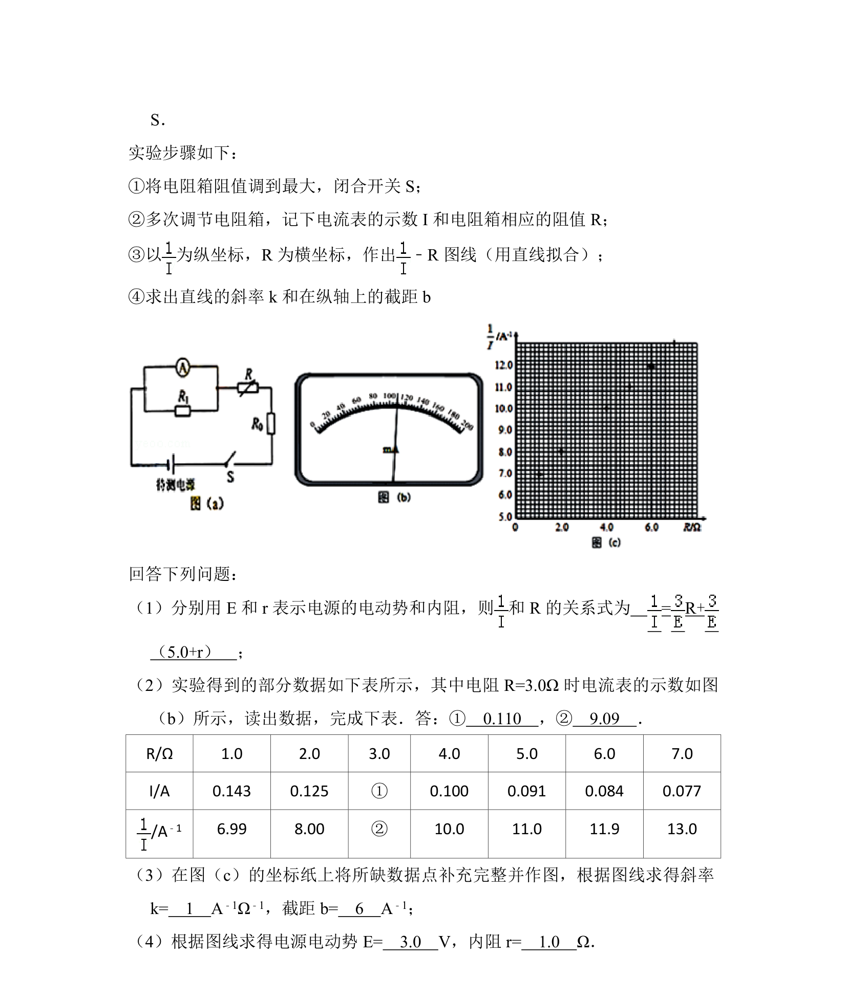
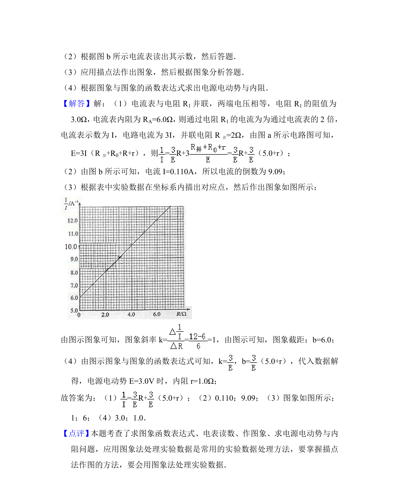

## 题面

## 摘要

利用电流表和电阻箱测量电源电动势和内阻，结合图像法进行数据处理。

## 关联考点

- [[测电源电动势和内阻]]
- [[332-闭合电路欧姆定律|闭合电路欧姆定律]]
- [[861-图像法处理数据|图像法处理数据]]
- [[690-电表改装|电表改装]]

## 答案与解析

> 📄 原 PDF 第 12 页：`素材/真题/湖南/2008-2024·（湖南）物理高考真题/2014年高考物理试卷（新课标Ⅰ）（解析卷）.pdf`
