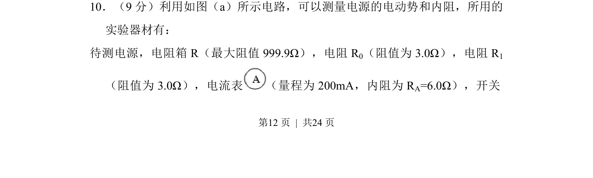
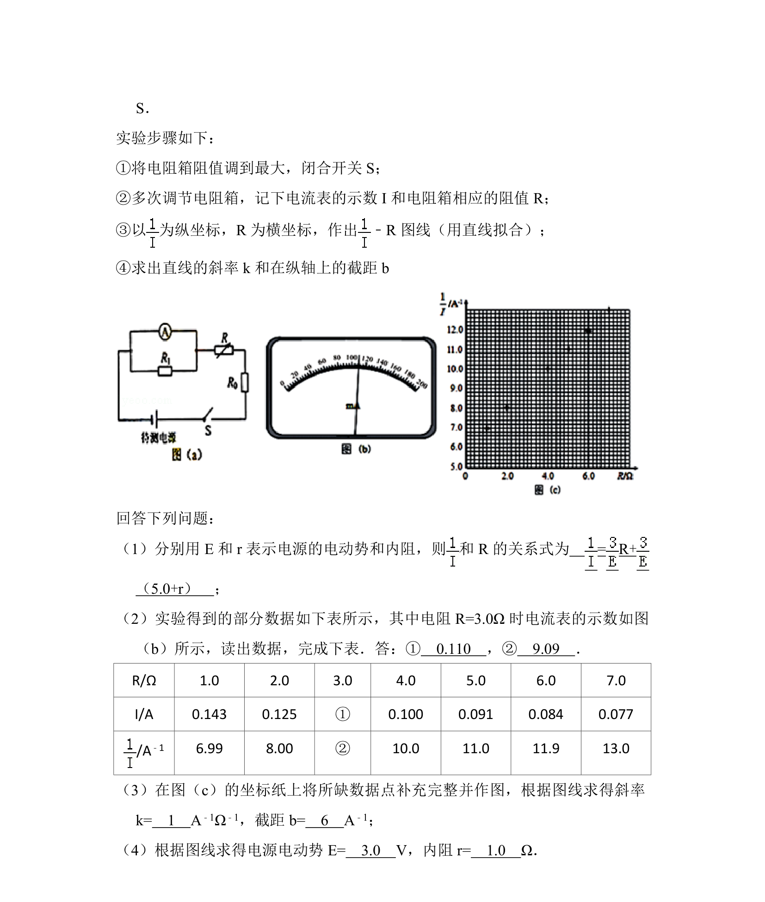
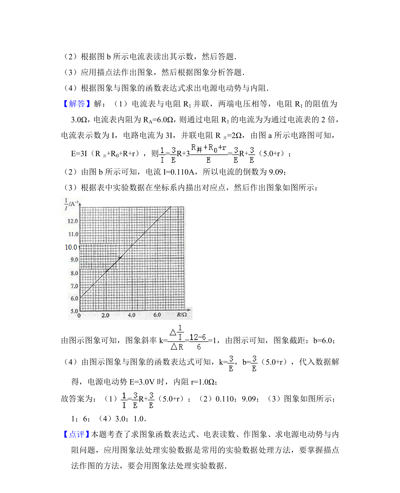

## 题面

## 摘要

利用电流表和电阻箱测量电源电动势和内阻，结合图像法进行数据处理。

## 关联考点

- [[测电源电动势和内阻]]
- [[332-闭合电路欧姆定律|闭合电路欧姆定律]]
- [[861-图像法处理数据|图像法处理数据]]
- [[690-电表改装|电表改装]]

## 答案与解析

> 📄 原 PDF 第 12 页：`素材/真题/湖南/2008-2024·（湖南）物理高考真题/2014年高考物理试卷（新课标Ⅰ）（解析卷）.pdf`

<!-- 题干文本-start -->
## 题干文本
10．（9分）利用如图（a）所示电路，可以测量电源的电动势和内阻，所用的
实验器材有：
待测电源，电阻箱R（最大阻值999.9Ω），电阻R 0（阻值为3.0Ω），电阻R 1
（阻值为3.0Ω），电流表 （量程为200mA，内阻为R A=6.0Ω），开关
<!-- 题干文本-end -->

<!-- 解析文本-start -->
## 解析文本

<!-- 解析文本-end -->
