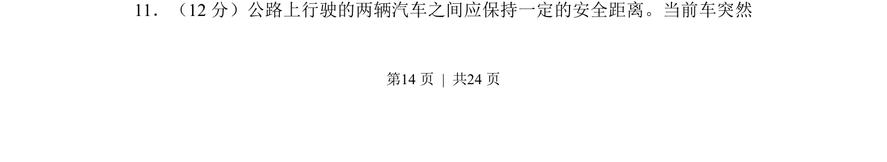
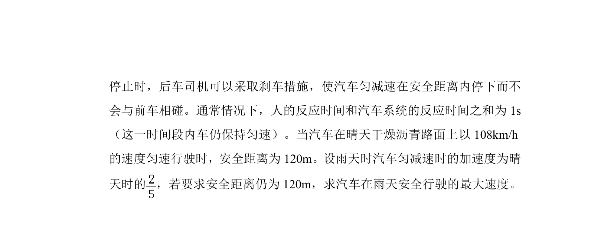
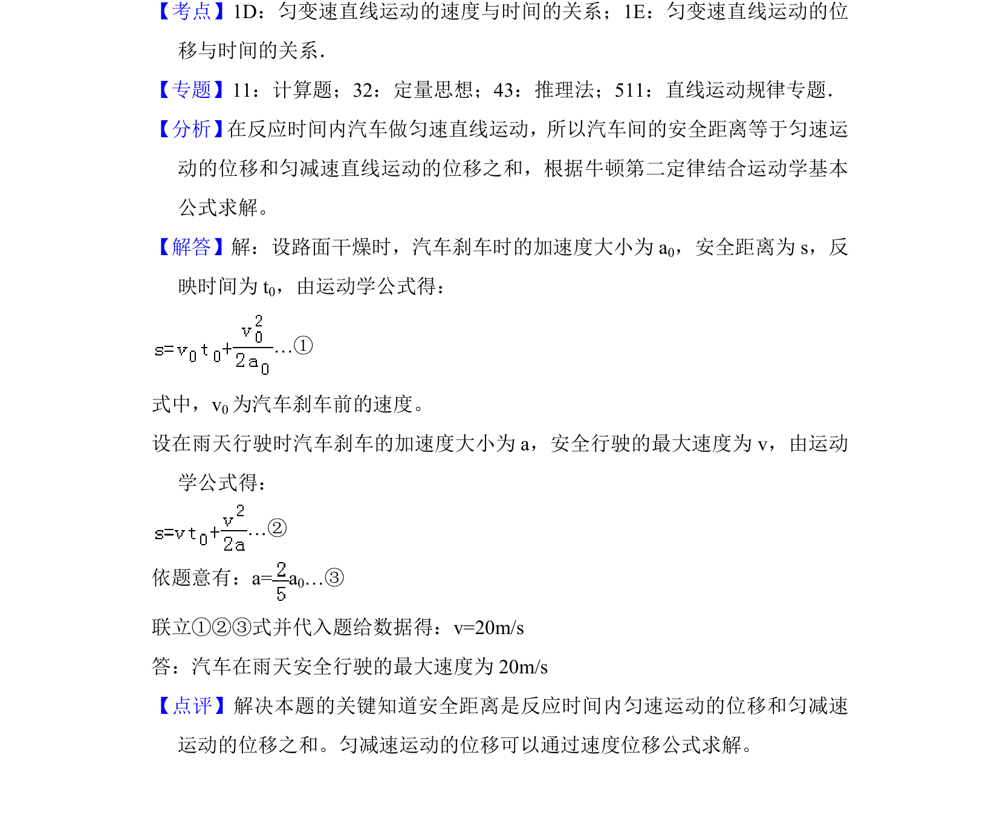

## 题面

## 摘要

两辆汽车行驶中安全距离的计算问题，涉及前车突然停止时后车的反应与制动过程。

## 关联考点

- [[215-匀变速直线运动|匀变速直线运动]]
- [[822-追及相遇问题|追及相遇问题]]
- [[安全距离]]

## 答案与解析

> 📄 原 PDF 第 14 页：`素材/真题/湖南/2008-2024·（湖南）物理高考真题/2014年高考物理试卷（新课标Ⅰ）（解析卷）.pdf`
