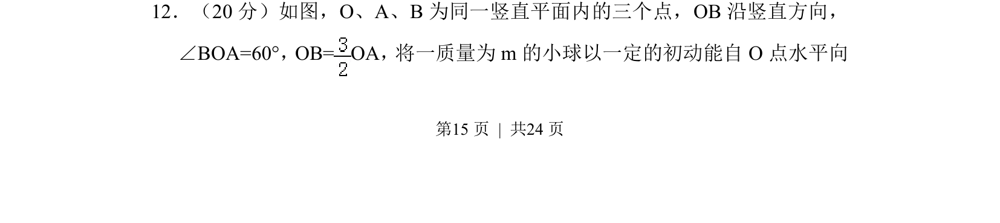
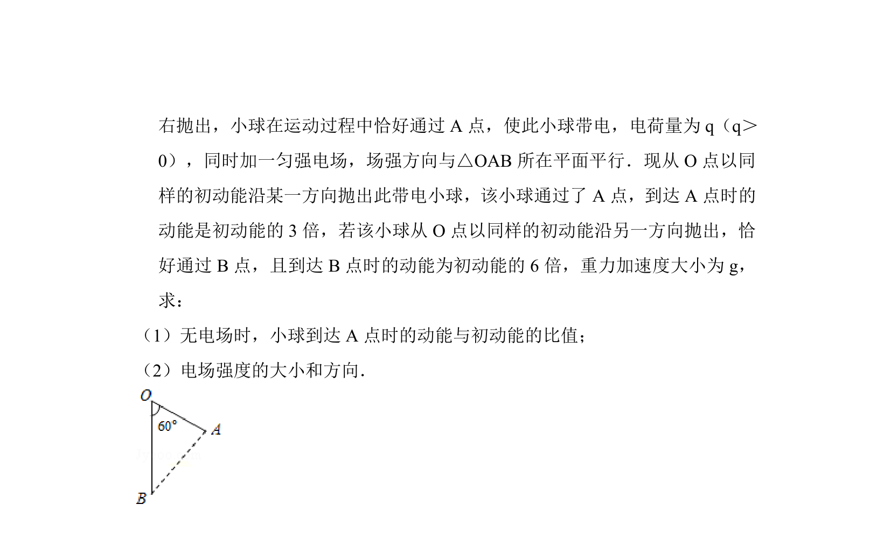
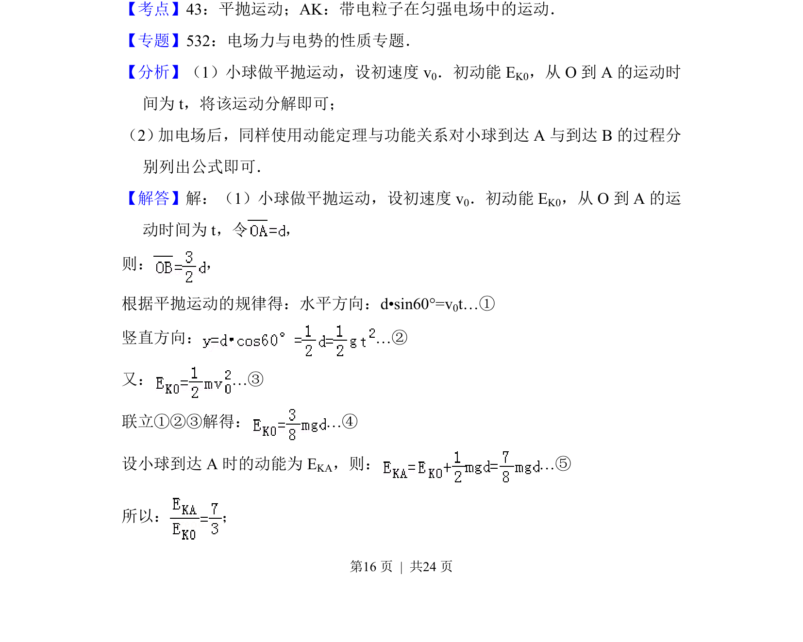
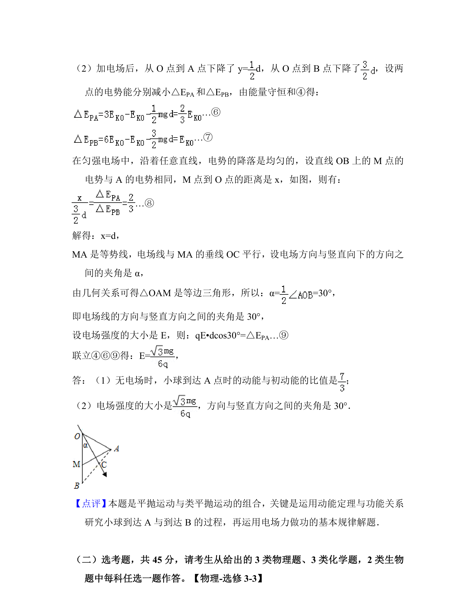

## 题面

## 摘要

小球从O点水平抛出，做平抛运动，结合几何关系与动能定理分析运动过程。

## 关联考点

- [[261-平抛运动|平抛运动]]
- [[251-动能定理|动能定理]]
- [[288-运动的合成与分解|运动的合成与分解]]
- [[几何约束]]

## 答案与解析

> 📄 原 PDF 第 15 页：`素材/真题/湖南/2008-2024·（湖南）物理高考真题/2014年高考物理试卷（新课标Ⅰ）（解析卷）.pdf`
