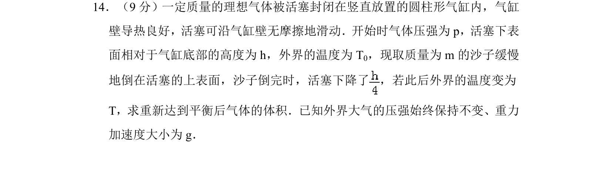
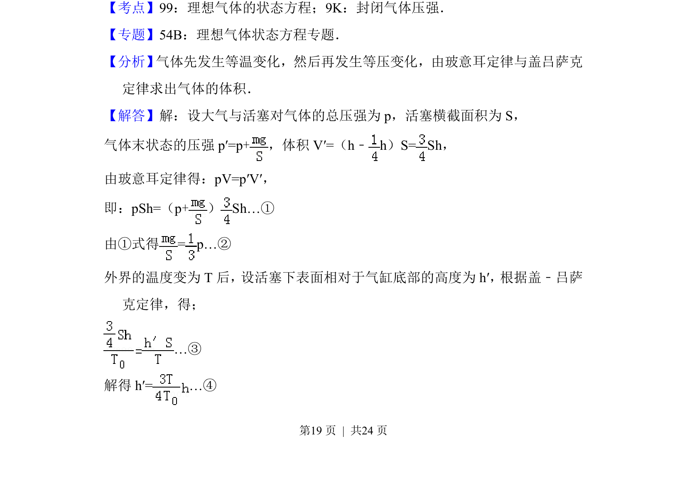
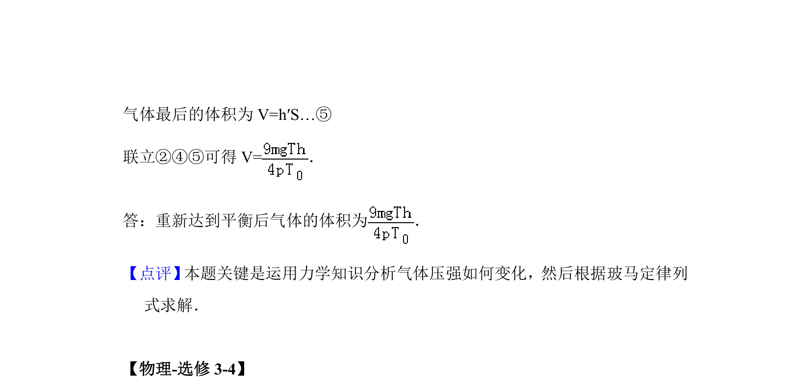

## 题面

## 摘要

气体先等温压缩后等压膨胀，利用玻意耳定律和盖-吕萨克定律求体积。

## 关联考点

- [[446-理想气体状态方程|理想气体的状态方程]]
- [[591-封闭气体压强|封闭气体压强]]

## 答案与解析

> 📄 原 PDF 第 19 页：`素材/真题/湖南/2008-2024·（湖南）物理高考真题/2014年高考物理试卷（新课标Ⅰ）（解析卷）.pdf`

<!-- 题干文本-start -->
## 题干文本
14．（9分）一定质量的理想气体被活塞封闭在竖直放置的圆柱形气缸内，气缸
壁导热良好，活塞可沿气缸壁无摩擦地滑动．开始时气体压强为p，活塞下表
面相对于气缸底部的高度为h，外界的温度为T 0，现取质量为m的沙子缓慢
地倒在活塞的上表面，沙子倒完时，活塞下降了 ，若此后外界的温度变为
T，求重新达到平衡后气体的体积．已知外界大气的压强始终保持不变、重力
加速度大小为g．
<!-- 题干文本-end -->

<!-- 解析文本-start -->
## 解析文本
【考点】99：理想气体的状态方程；9K：封闭气体压强．菁优网版权所有
【专题】54B：理想气体状态方程专题．
【分析】 气体先发生等温变化，然后再发生等压变化，由玻意耳定律与盖吕萨克
定律求出气体的体积．
【解答】解：设大气与活塞对气体的总压强为p，活塞横截面积为S，
气体末状态的压强p′=p+，体积V′=（h﹣h）S= Sh，
由玻意耳定律得：pV=p′V′，
即：pSh=（p+）Sh…①
由①式得= p…②
外界的温度变为T后，设活塞下表面相对于气缸底部的高度为h′，根据盖﹣吕萨
克定律，得；
…③
解得h′=…④
<!-- 解析文本-end -->
