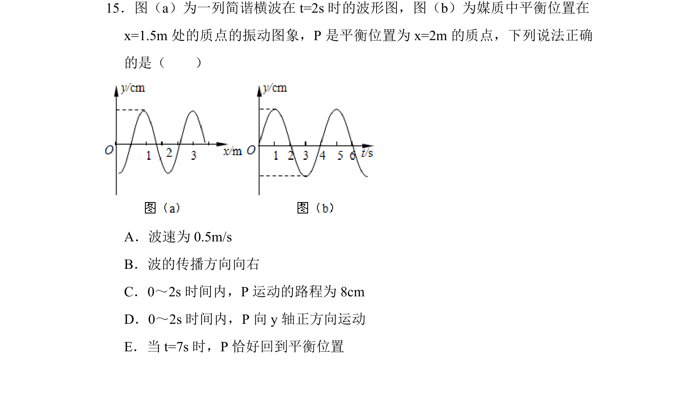
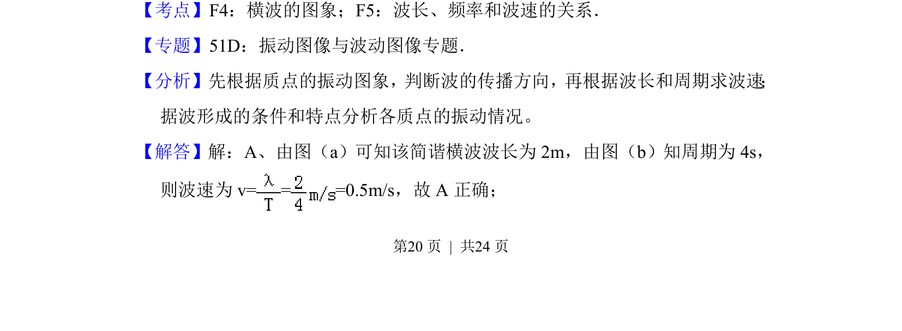
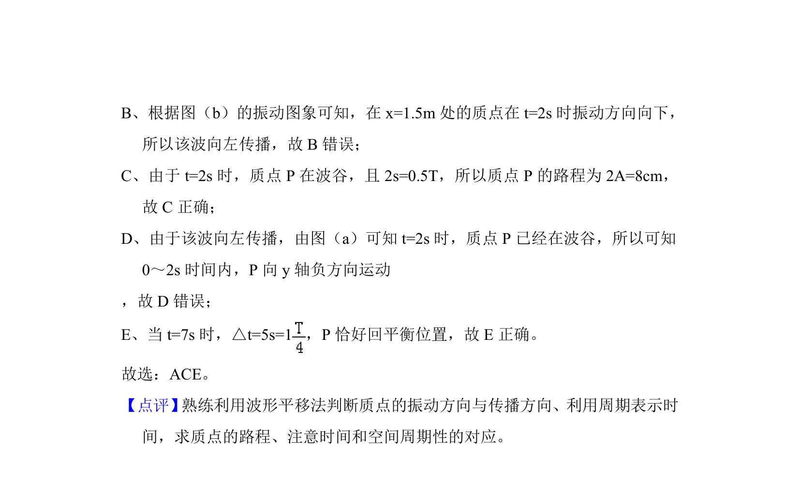

## 题面

## 摘要

一列简谐横波波形图与质点振动图象结合，考查波速计算、传播方向判断及质点运动情况分析。

## 关联考点

- [[630-横波的图象|横波的图象]]
- [[370-波长|波长]]
- [[749-频率和波速的关系|频率和波速的关系]]
- [[614-振动图象|振动图象]]

## 答案与解析

> 📄 原 PDF 第 20 页：`素材/真题/湖南/2008-2024·（湖南）物理高考真题/2014年高考物理试卷（新课标Ⅰ）（解析卷）.pdf`
