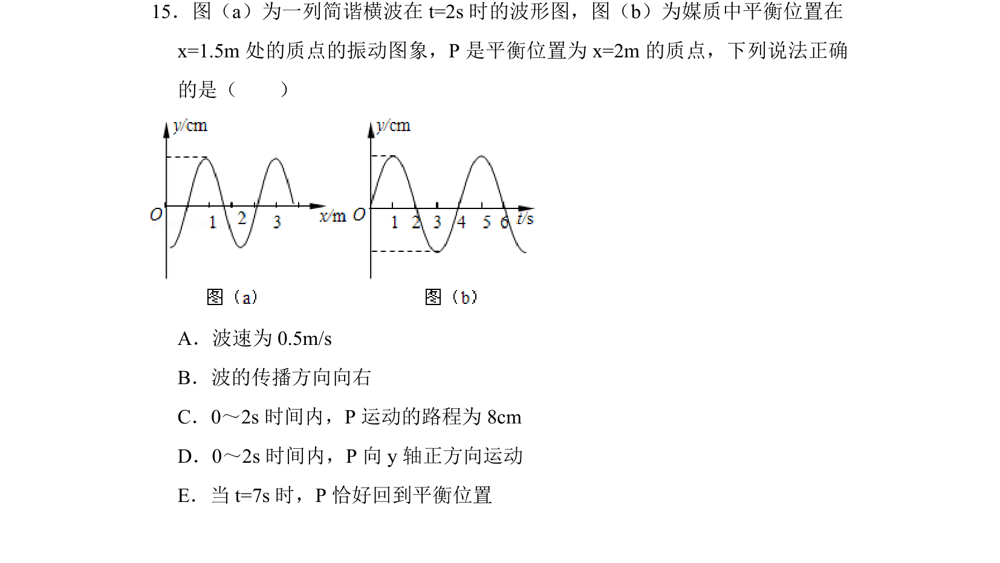
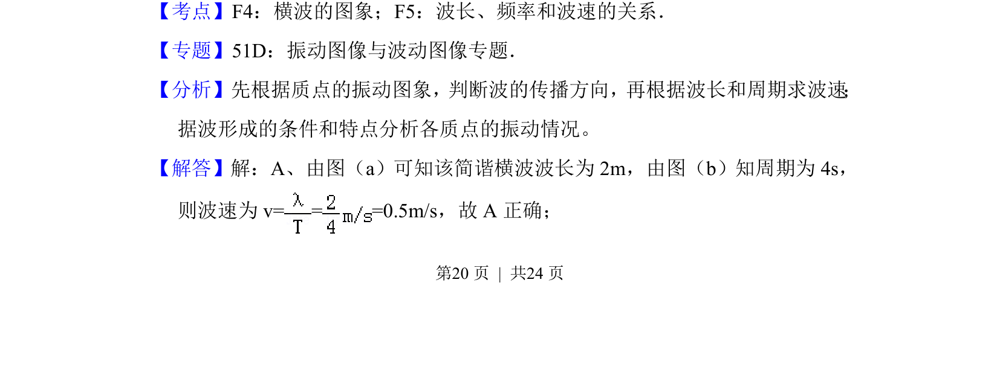
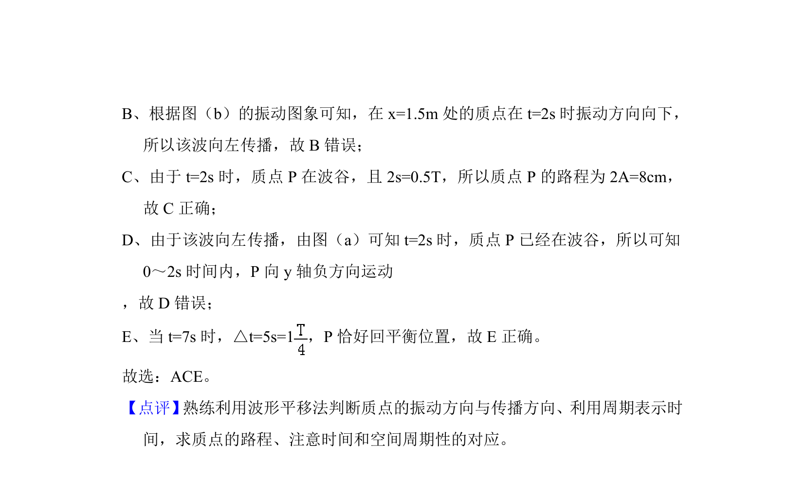

## 题面

## 摘要

一列简谐横波波形图与质点振动图象结合，考查波速计算、传播方向判断及质点运动情况分析。

## 关联考点

- [[630-横波的图象|横波的图象]]
- [[370-波长|波长]]
- [[749-频率和波速的关系|频率和波速的关系]]
- [[857-振动图像|振动图象]]

## 答案与解析

> 📄 原 PDF 第 20 页：`素材/真题/湖南/2008-2024·（湖南）物理高考真题/2014年高考物理试卷（新课标Ⅰ）（解析卷）.pdf`

<!-- 题干文本-start -->
## 题干文本
15．图（a）为一列简谐横波在t=2s时的波形图，图（b）为媒质中平衡位置在
x=1.5m处的质点的振动图象，P是平衡位置为x=2m的质点，下列说法正确
的是（　　）
A．波速为0.5m/s
B．波的传播方向向右
C．0～2s时间内，P运动的路程为8cm
D．0～2s时间内，P向y轴正方向运动
E．当t=7s时，P恰好回到平衡位置
<!-- 题干文本-end -->

<!-- 解析文本-start -->
## 解析文本
【考点】F4：横波的图象；F5：波长、频率和波速的关系．菁优网版权所有
【专题】51D：振动图像与波动图像专题．
【分析】先根据质点的振动图象，判断波的传播方向，再根据波长和周期求波速 ；
据波形成的条件和特点分析各质点的振动情况。
【解答】解：A、由图（a）可知该简谐横波波长为2m，由图（b）知周期为4s，
则波速为v= = =0.5m/s，故A正确；
<!-- 解析文本-end -->
