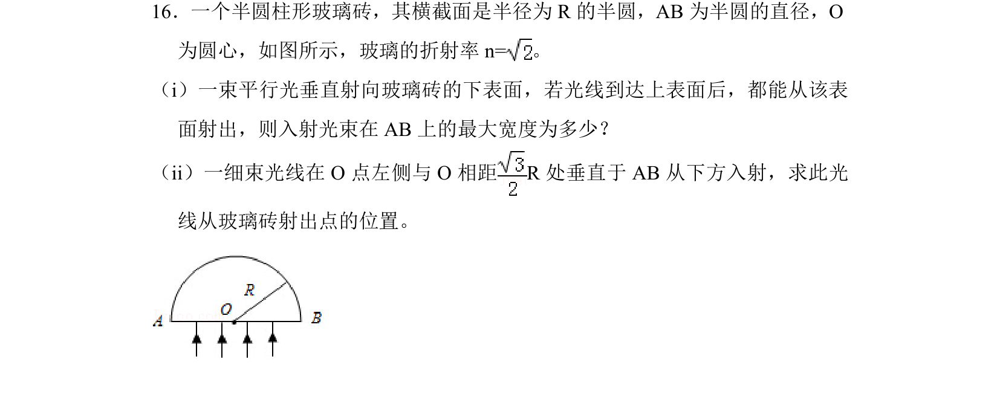
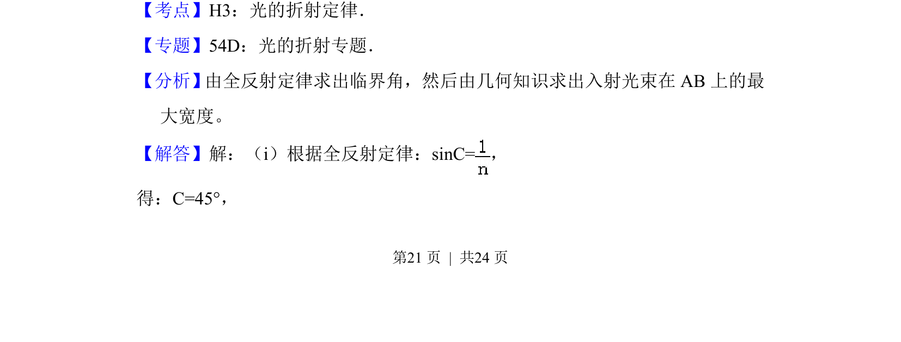
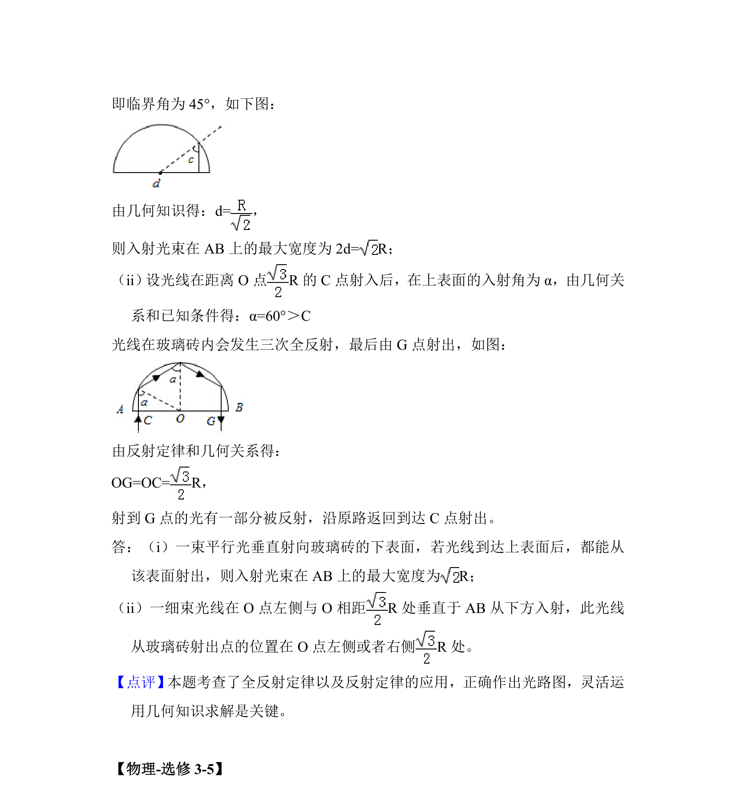

## 题面

## 摘要

一束平行光垂直射向半圆柱玻璃砖，求能从其上表面射出的入射光束最大宽度及细光束射出位置。

## 关联考点

- [[520-光的折射定律|光的折射定律]]
- [[343-全反射|全反射]]
- [[336-临界角|临界角]]
- [[455-几何光学|几何光学]]

## 答案与解析

> 📄 原 PDF 第 21 页：`素材/真题/湖南/2008-2024·（湖南）物理高考真题/2014年高考物理试卷（新课标Ⅰ）（解析卷）.pdf`
