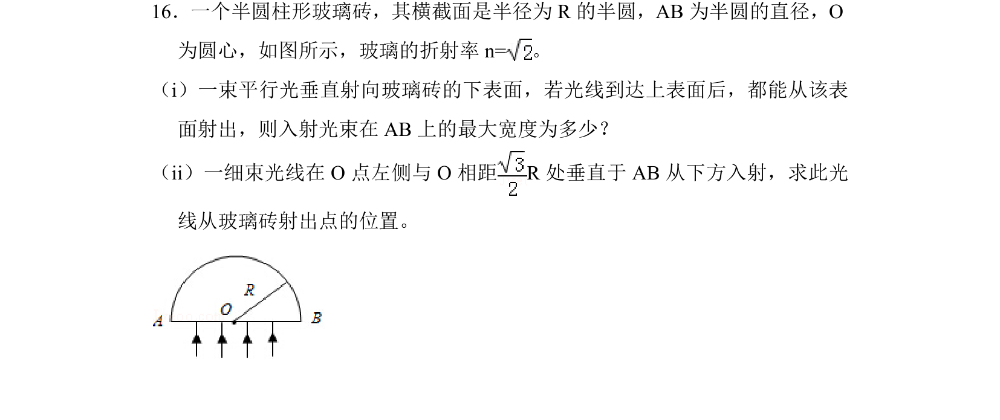
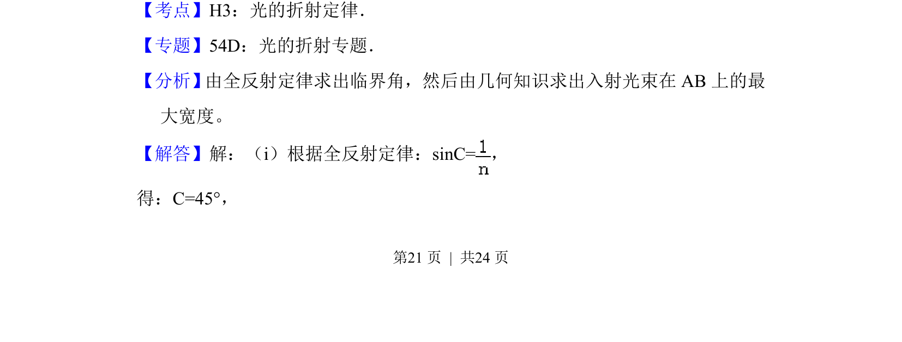
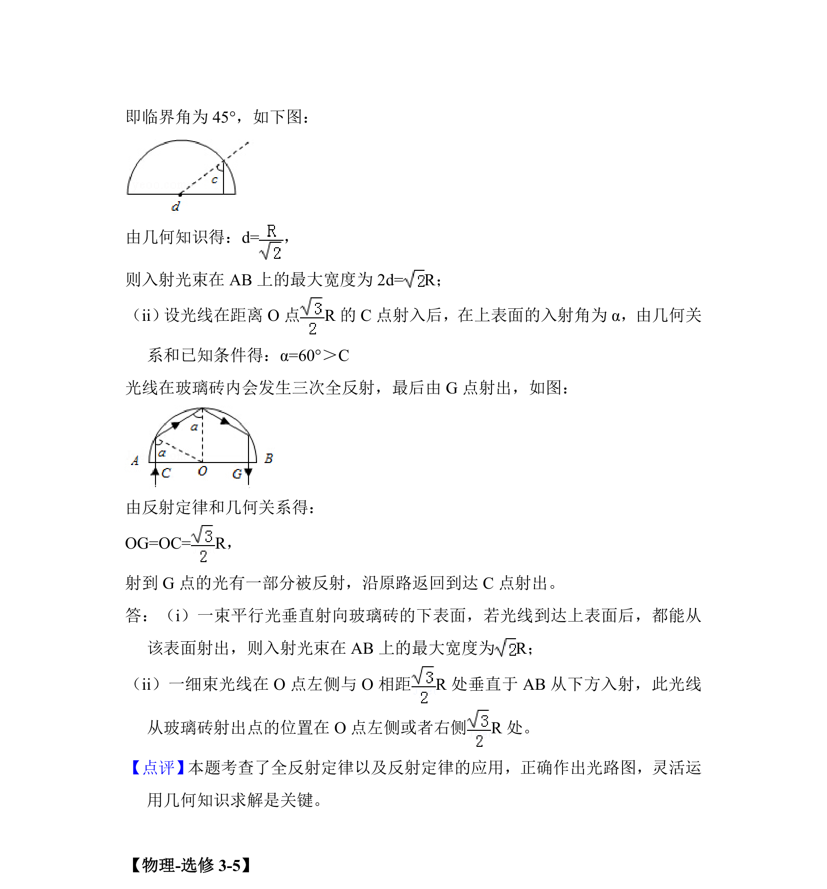

## 题面

## 摘要

一束平行光垂直射向半圆柱玻璃砖，求能从其上表面射出的入射光束最大宽度及细光束射出位置。

## 关联考点

- [[520-光的折射定律|光的折射定律]]
- [[343-全反射|全反射]]
- [[336-临界角|临界角]]
- [[455-几何光学|几何光学]]

## 答案与解析

> 📄 原 PDF 第 21 页：`素材/真题/湖南/2008-2024·（湖南）物理高考真题/2014年高考物理试卷（新课标Ⅰ）（解析卷）.pdf`

<!-- 题干文本-start -->
## 题干文本
16．一个半圆柱形玻璃砖，其横截面是半径为R的半圆，AB为半圆的直径，O
为圆心，如图所示，玻璃的折射率n=。
（i）一束平行光垂直射向玻璃砖的下表面，若光线到达上表面后，都能从该表
面射出，则入射光束在AB上的最大宽度为多少？
（ii）一细束光线在O点左侧与O相距R处垂直于AB从下方入射，求此光
线从玻璃砖射出点的位置。
<!-- 题干文本-end -->

<!-- 解析文本-start -->
## 解析文本
【考点】H3：光的折射定律．菁优网版权所有
【专题】54D：光的折射专题．
【分析】 由全反射定律求出临界角，然后由几何知识求出入射光束在AB上的最
大宽度。
【解答】解：（i）根据全反射定律：sinC=，
得：C=45°，
<!-- 解析文本-end -->
