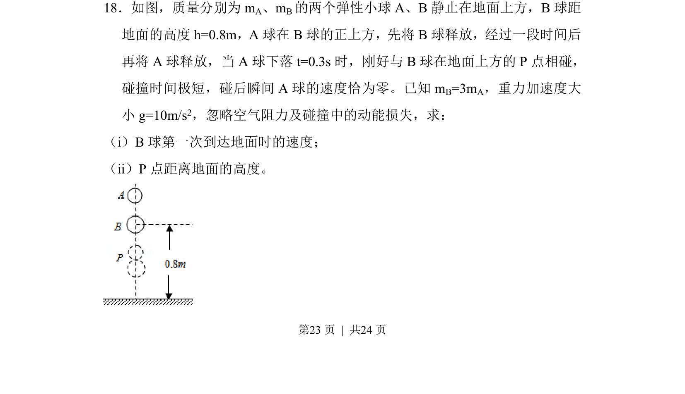
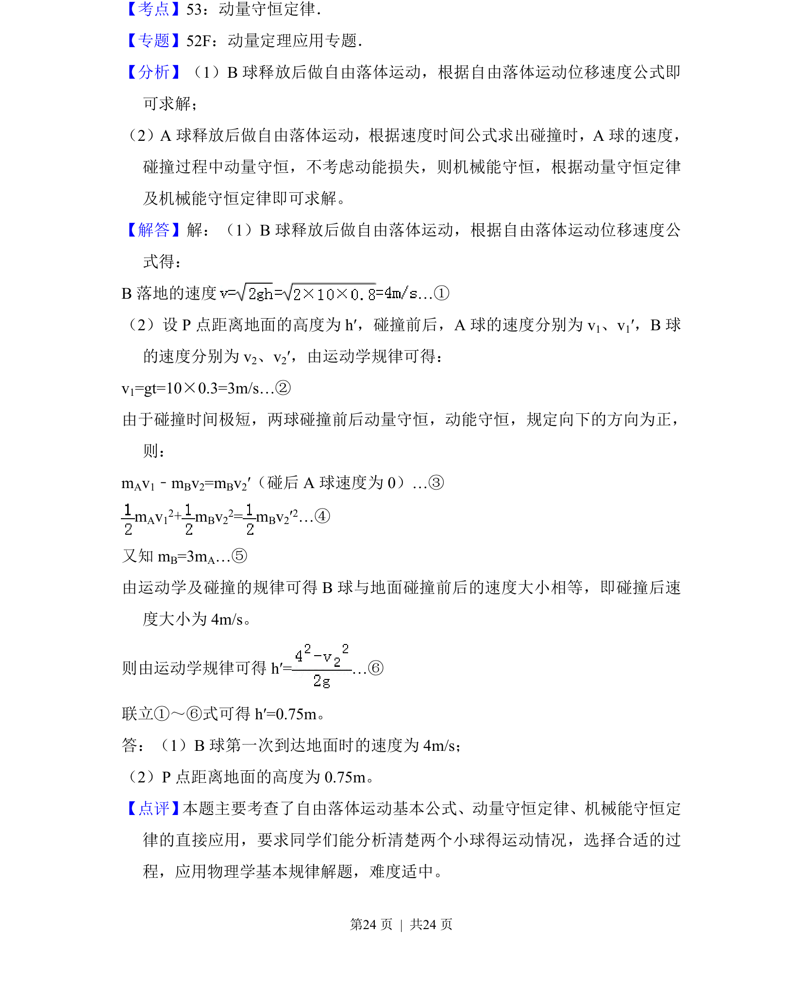

## 题面

## 摘要

两弹性小球先后释放并在空中发生弹性碰撞，求B球落地速度与碰撞点高度。

## 关联考点

- [[234-自由落体运动|自由落体运动]]
- [[359-弹性碰撞|弹性碰撞]]
- [[347-动量守恒定律|动量守恒定律]]
- [[085-机械能守恒-初中|机械能守恒定律]]

## 答案与解析

> 📄 原 PDF 第 23 页：`素材/真题/湖南/2008-2024·（湖南）物理高考真题/2014年高考物理试卷（新课标Ⅰ）（解析卷）.pdf`
