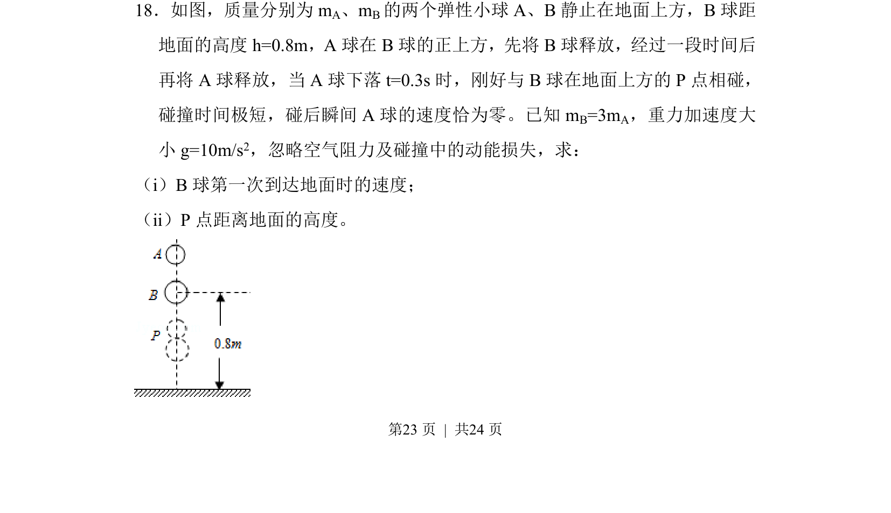
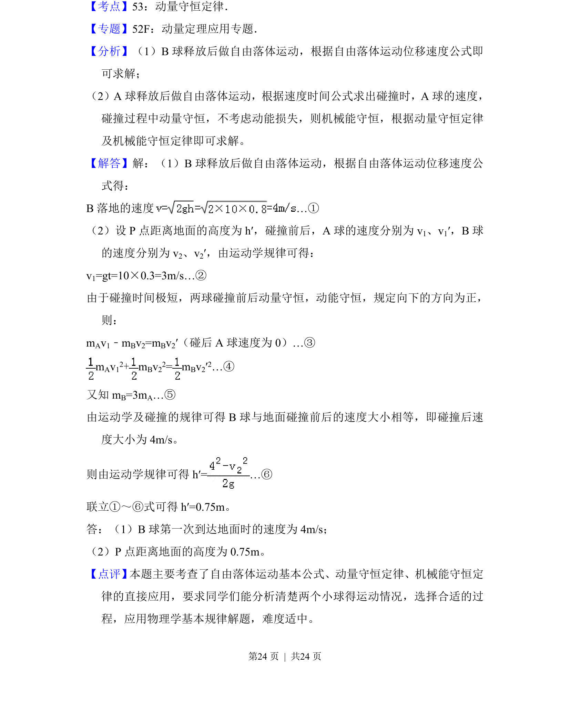

## 题面

## 摘要

两弹性小球先后释放并在空中发生弹性碰撞，求B球落地速度与碰撞点高度。

## 关联考点

- [[234-自由落体运动|自由落体运动]]
- [[359-弹性碰撞|弹性碰撞]]
- [[347-动量守恒定律|动量守恒定律]]
- [[085-机械能守恒-初中|机械能守恒定律]]

## 答案与解析

> 📄 原 PDF 第 23 页：`素材/真题/湖南/2008-2024·（湖南）物理高考真题/2014年高考物理试卷（新课标Ⅰ）（解析卷）.pdf`

<!-- 题干文本-start -->
## 题干文本
18．如图，质量分别为m A、mB的两个弹性小球A、B静止在地面上方，B球距
地面的高度h=0.8m，A球在B球的正上方，先将B球释放，经过一段时间后
再将A球释放，当A球下落t=0.3s时，刚好与B球在地面上方的P点相碰，
碰撞时间极短，碰后瞬间A球的速度恰为零。已知m B=3mA，重力加速度大
小g=10m/s 2，忽略空气阻力及碰撞中的动能损失，求：
（i）B球第一次到达地面时的速度；
（ii）P点距离地面的高度。
<!-- 题干文本-end -->

<!-- 解析文本-start -->
## 解析文本

<!-- 解析文本-end -->
