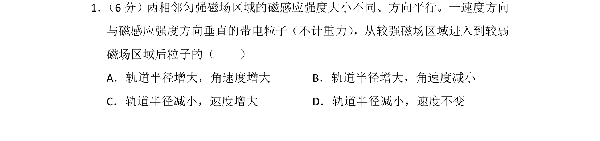
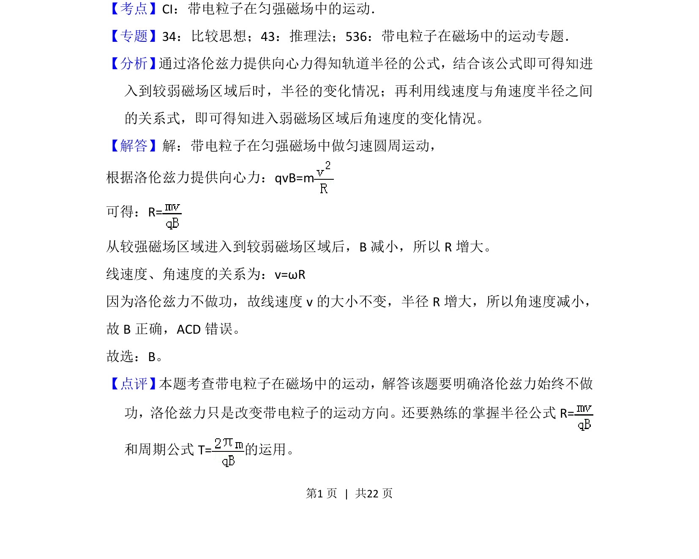

## 题面

## 摘要

带电粒子从强磁场进入弱磁场，轨道半径增大而角速度减小。

## 关联考点

- [[595-带电粒子在匀强磁场中的运动|带电粒子在匀强磁场中的运动]]
- [[649-洛伦兹力提供向心力|洛伦兹力提供向心力]]
- [[866-轨道半径|轨道半径]]
- [[286-角速度|角速度]]

## 答案与解析

> 📄 原 PDF 第 1 页：`素材/真题/湖南/2008-2024·（湖南）物理高考真题/2015年高考物理试卷（新课标Ⅰ）（解析卷）.pdf`
