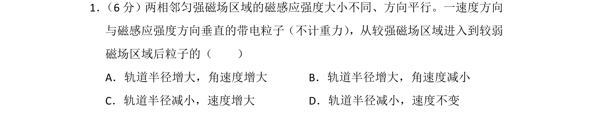
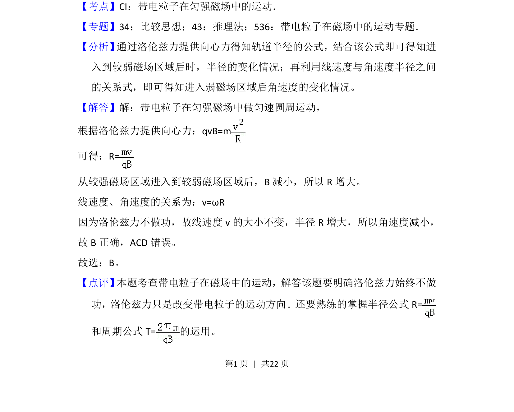

## 题面

## 摘要

带电粒子从强磁场进入弱磁场，轨道半径增大而角速度减小。

## 关联考点

- [[595-带电粒子在匀强磁场中的运动|带电粒子在匀强磁场中的运动]]
- [[649-洛伦兹力提供向心力|洛伦兹力提供向心力]]
- [[866-轨道半径|轨道半径]]
- [[286-角速度|角速度]]

## 答案与解析

> 📄 原 PDF 第 1 页：`素材/真题/湖南/2008-2024·（湖南）物理高考真题/2015年高考物理试卷（新课标Ⅰ）（解析卷）.pdf`

<!-- 题干文本-start -->
## 题干文本
1． （6分）两相邻匀强磁场区域的磁感应强度大小不同、方向平行。一速度方向
与磁感应强度方向垂直的带电粒子（不计重力） ，从较强磁场区域进入到较弱
磁场区域后粒子的（　　）
A．轨道半径增大，角速度增大B．轨道半径增大，角速度减小
C．轨道半径减小，速度增大D．轨道半径减小，速度不变
<!-- 题干文本-end -->

<!-- 解析文本-start -->
## 解析文本
【考点】CI：带电粒子在匀强磁场中的运动．菁优网版权所有
【专题】34：比较思想；43：推理法；536：带电粒子在磁场中的运动专题．
【分析】 通过洛伦兹力提供向心力得知轨道半径的公式，结合该公式即可得知进
入到较弱磁场区域后时，半径的变化情况；再利用线速度与角速度半径之间
的关系式，即可得知进入弱磁场区域后角速度的变化情况。
【解答】解：带电粒子在匀强磁场中做匀速圆周运动，
根据洛伦兹力提供向心力：qvB=m
可得：R=
从较强磁场区域进入到较弱磁场区域后，B减小，所以R增大。
线速度、角速度的关系为：v=ωR
因为洛伦兹力不做功，故线速度v的大小不变，半径R增大，所以角速度减小，
故B正确，ACD错误。
故选：B。
【点评】 本题考查带电粒子在磁场中的运动，解答该题要明确洛伦兹力始终不做
功，洛伦兹力只是改变带电粒子的运动方向。还要熟练的掌握半径公式R=
和周期公式T=的运用。
<!-- 解析文本-end -->
