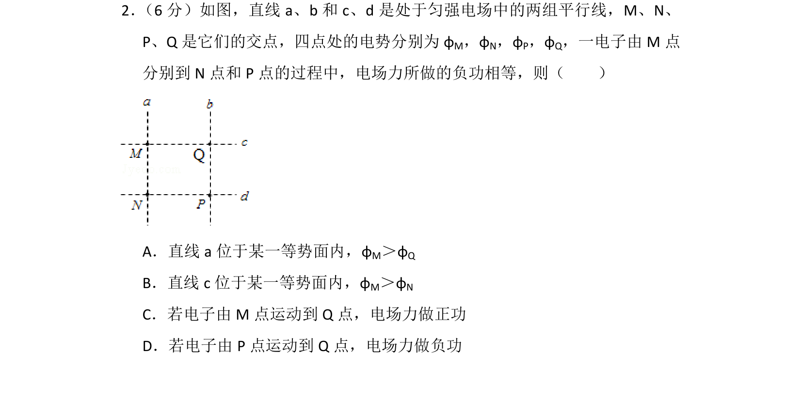
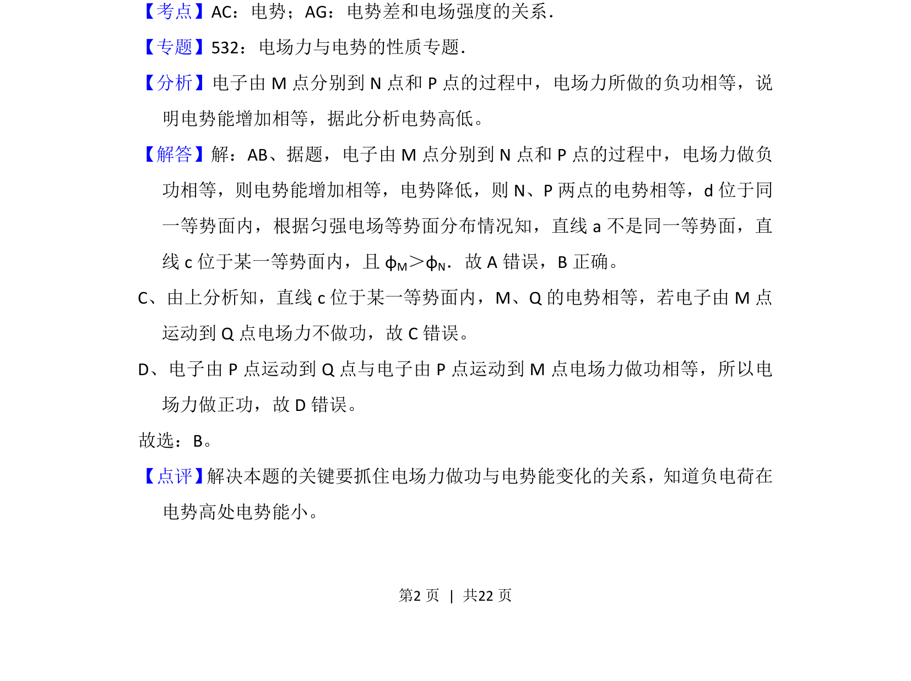

## 题面

## 摘要

该题通过电子在匀强电场中移动时电场力做负功相等，判断等势面位置及电势高低。

## 关联考点

- [[308-电势|电势]]
- [[282-等势面|等势面]]
- [[673-电场力做功|电场力做功]]
- [[252-匀强电场|匀强电场]]

## 答案与解析

> 📄 原 PDF 第 2 页：`素材/真题/湖南/2008-2024·（湖南）物理高考真题/2015年高考物理试卷（新课标Ⅰ）（解析卷）.pdf`
