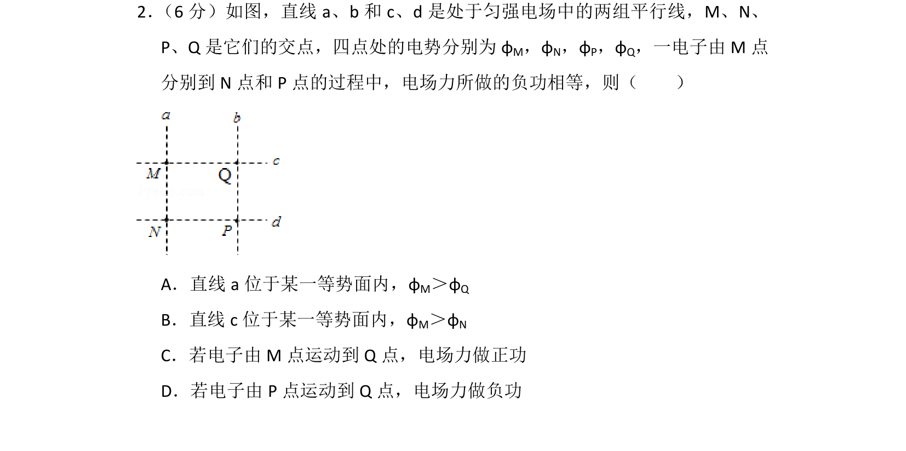
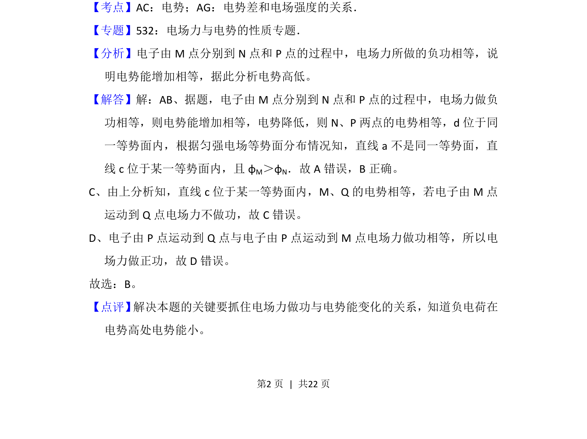

## 题面

## 摘要

该题通过电子在匀强电场中移动时电场力做负功相等，判断等势面位置及电势高低。

## 关联考点

- [[308-电势|电势]]
- [[282-等势面|等势面]]
- [[673-电场力做功|电场力做功]]
- [[252-匀强电场|匀强电场]]

## 答案与解析

> 📄 原 PDF 第 2 页：`素材/真题/湖南/2008-2024·（湖南）物理高考真题/2015年高考物理试卷（新课标Ⅰ）（解析卷）.pdf`

<!-- 题干文本-start -->
## 题干文本
2． （6分）如图，直线a、b和c、d是处于匀强电场中的两组平行线，M、N、
P、Q是它们的交点，四点处的电势分别为φ M，φN，φP，φQ，一电子由M点
分别到N点和P点的过程中，电场力所做的负功相等，则（　　）
A．直线a位于某一等势面内，φ M＞φQ
B．直线c位于某一等势面内，φ M＞φN
C．若电子由M点运动到Q点，电场力做正功
D．若电子由P点运动到Q点，电场力做负功
<!-- 题干文本-end -->

<!-- 解析文本-start -->
## 解析文本
【考点】AC：电势；AG：电势差和电场强度的关系．菁优网版权所有
【专题】532：电场力与电势的性质专题．
【分析】电子由M点分别到N点和P点的过程中，电场力所做的负功相等，说
明电势能增加相等，据此分析电势高低。
【解答】解：AB、据题，电子由M点分别到N点和P点的过程中，电场力做负
功相等，则电势能增加相等，电势降低，则N、P两点的电势相等，d位于同
一等势面内，根据匀强电场等势面分布情况知，直线a不是同一等势面，直
线c位于某一等势面内，且φ M＞φN．故A错误，B正确。
C、由上分析知，直线c位于某一等势面内，M、Q的电势相等，若电子由M点
运动到Q点电场力不做功，故C错误。
D、电子由P点运动到Q点与电子由P点运动到M点电场力做功相等，所以电
场力做正功，故D错误。
故选：B。
【点评】 解决本题的关键要抓住电场力做功与电势能变化的关系，知道负电荷在
电势高处电势能小。
<!-- 解析文本-end -->
