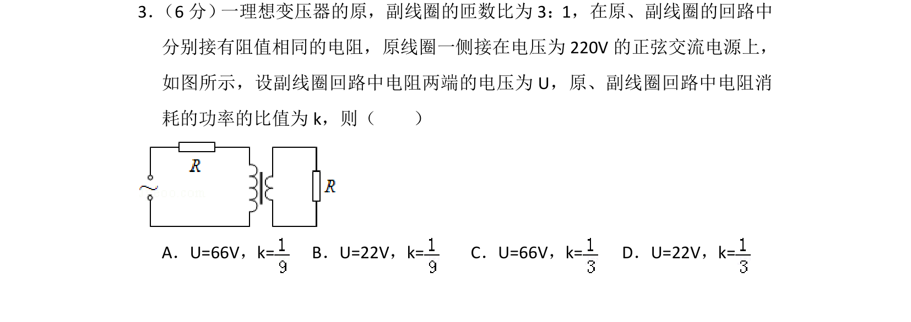
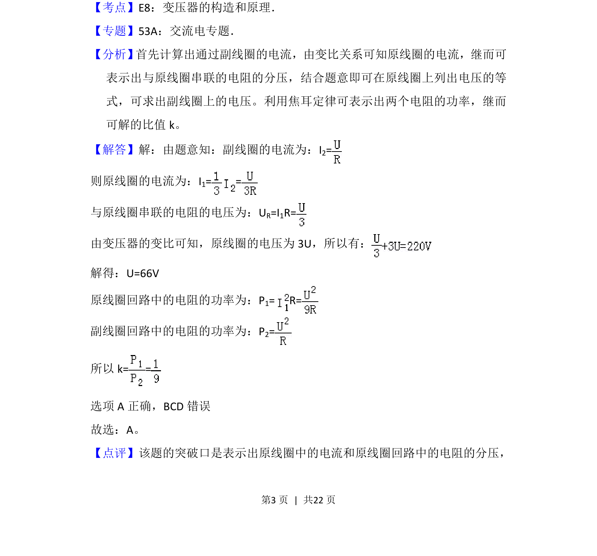

## 题面

## 摘要

1，原副线圈回路串接相同电阻，求副线圈电压及功率比。

## 关联考点

- [[理想变压器原理]]
- [[141-欧姆定律-初中|欧姆定律]]
- [[159-电功率|电功率]]
- [[504-串并联电路|串并联电路]]

## 答案与解析

> 📄 原 PDF 第 3 页：`素材/真题/湖南/2008-2024·（湖南）物理高考真题/2015年高考物理试卷（新课标Ⅰ）（解析卷）.pdf`
