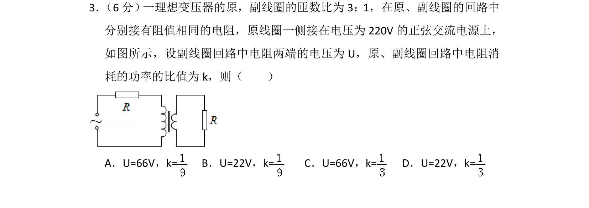
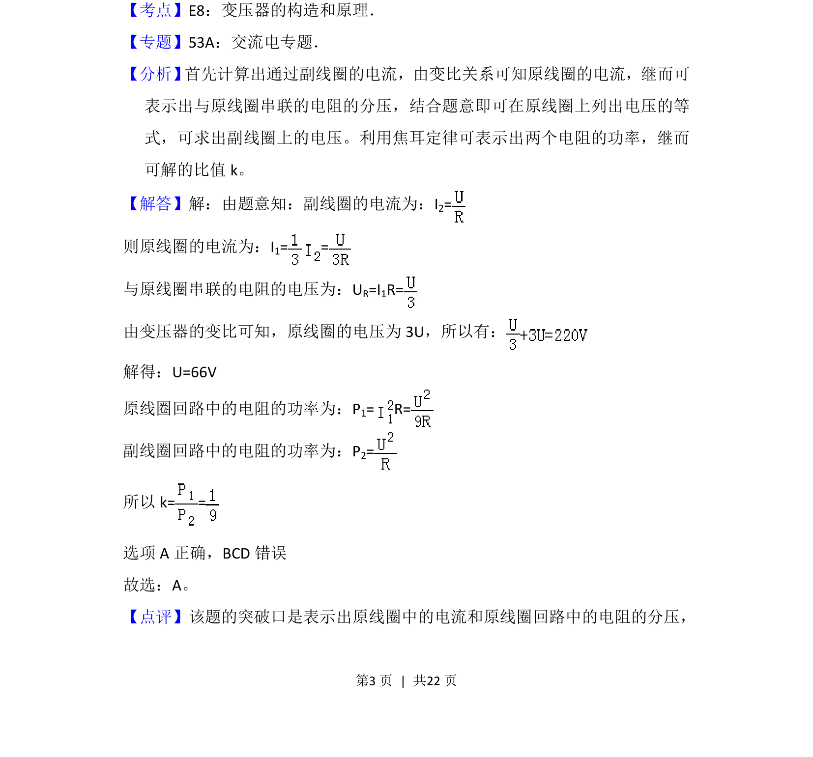

## 题面

## 摘要

1，原副线圈回路串接相同电阻，求副线圈电压及功率比。

## 关联考点

- [[理想变压器原理]]
- [[141-欧姆定律-初中|欧姆定律]]
- [[159-电功率|电功率]]
- [[504-串并联电路|串并联电路]]

## 答案与解析

> 📄 原 PDF 第 3 页：`素材/真题/湖南/2008-2024·（湖南）物理高考真题/2015年高考物理试卷（新课标Ⅰ）（解析卷）.pdf`

<!-- 题干文本-start -->
## 题干文本
3． （6分） 一理想变压器的原，副线圈的匝数比为3：1，在原、副线圈的回路中
分别接有阻值相同的电阻，原线圈一侧接在电压为220V的正弦交流电源上，
如图所示，设副线圈回路中电阻两端的电压为U，原、副线圈回路中电阻消
耗的功率的比值为k，则（　　）
A．U=66V，k= B．U=22V，k= C．U=66V，k= D．U=22V，k=
<!-- 题干文本-end -->

<!-- 解析文本-start -->
## 解析文本
【考点】E8：变压器的构造和原理．菁优网版权所有
【专题】53A：交流电专题．
【分析】 首先计算出通过副线圈的电流，由变比关系可知原线圈的电流，继而可
表示出与原线圈串联的电阻的分压，结合题意即可在原线圈上列出电压的等
式，可求出副线圈上的电压。利用焦耳定律可表示出两个电阻的功率，继而
可解的比值k。
【解答】解：由题意知：副线圈的电流为：I2=
则原线圈的电流为：I1= =
与原线圈串联的电阻的电压为：UR=I1R=
由变压器的变比可知，原线圈的电压为3U，所以有：
解得：U=66V
原线圈回路中的电阻的功率为：P1= R=
副线圈回路中的电阻的功率为：P2=
所以k= =
选项A正确，BCD错误
故选：A。
【点评】该题的突破口是表示出原线圈中的电流和原线圈回路中的电阻的分压，
<!-- 解析文本-end -->
