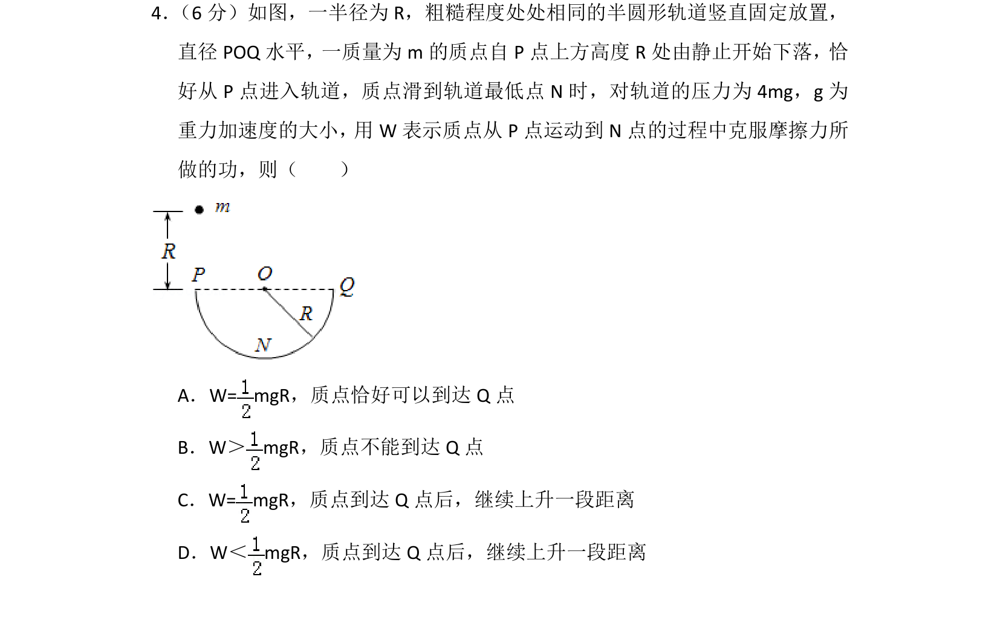
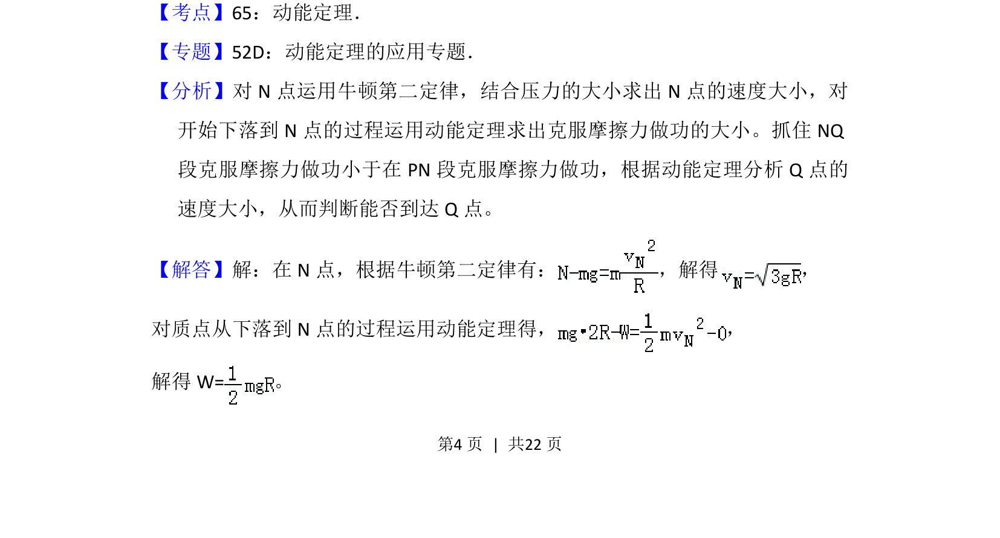
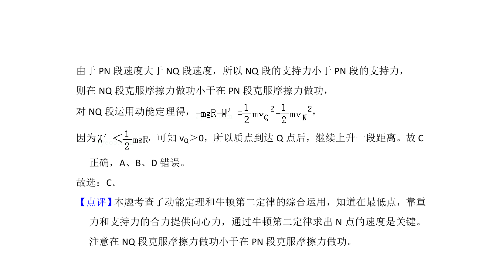

## 题面

## 摘要

质点从静止下落进入粗糙半圆形轨道，用动能定理和牛顿第二定律求克服摩擦力做功并判断到达Q点情况。

## 关联考点

- [[251-动能定理|动能定理]]
- [[229-牛顿第二定律|牛顿第二定律]]
- [[256-向心力|向心力]]
- [[765-摩擦力做功|摩擦力做功]]

## 答案与解析

> 📄 原 PDF 第 4 页：`素材/真题/湖南/2008-2024·（湖南）物理高考真题/2015年高考物理试卷（新课标Ⅰ）（解析卷）.pdf`
