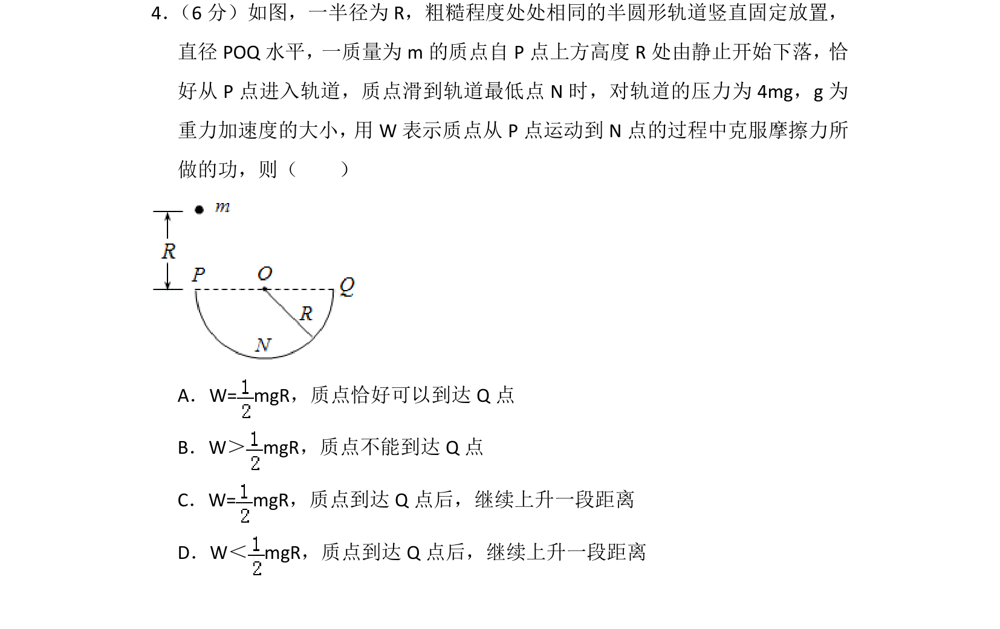
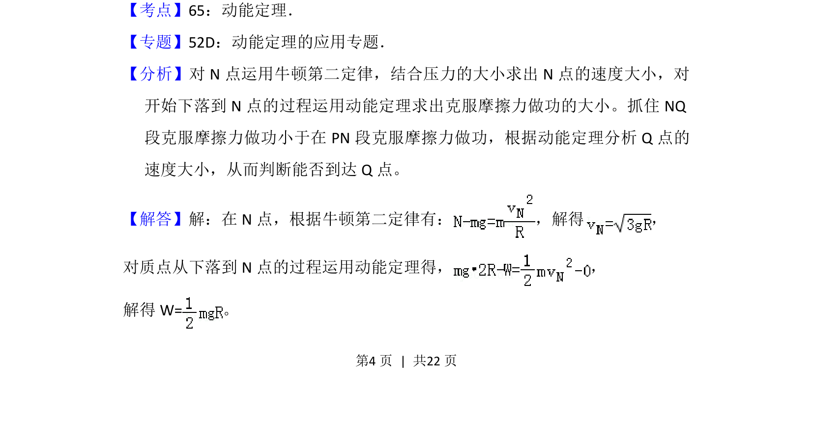
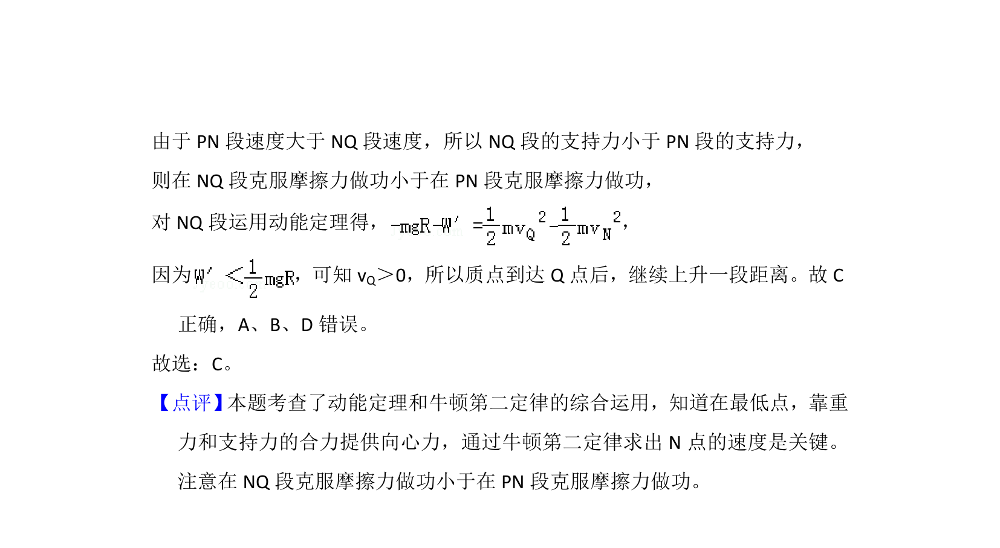

## 题面

## 摘要

质点从静止下落进入粗糙半圆形轨道，用动能定理和牛顿第二定律求克服摩擦力做功并判断到达Q点情况。

## 关联考点

- [[251-动能定理|动能定理]]
- [[229-牛顿第二定律|牛顿第二定律]]
- [[256-向心力|向心力]]
- [[765-摩擦力做功|摩擦力做功]]

## 答案与解析

> 📄 原 PDF 第 4 页：`素材/真题/湖南/2008-2024·（湖南）物理高考真题/2015年高考物理试卷（新课标Ⅰ）（解析卷）.pdf`

<!-- 题干文本-start -->
## 题干文本
4． （6分）如图，一半径为R，粗糙程度处处相同的半圆形轨道竖直固定放置，
直径POQ水平，一质量为m的质点自P点上方高度R处由静止开始下落，恰
好从P点进入轨道，质点滑到轨道最低点N时，对轨道的压力为4mg，g为
重力加速度的大小， 用W表示质点从P点运动到N点的过程中克服摩擦力所
做的功，则（　　）
A．W= mgR，质点恰好可以到达Q点
B．W＞mgR，质点不能到达Q点
C．W= mgR，质点到达Q点后，继续上升一段距离
D．W＜mgR，质点到达Q点后，继续上升一段距离
<!-- 题干文本-end -->

<!-- 解析文本-start -->
## 解析文本
【考点】65：动能定理．菁优网版权所有
【专题】52D：动能定理的应用专题．
【分析】对N点运用牛顿第二定律，结合压力的大小求出N点的速度大小，对
开始下落到N点的过程运用动能定理求出克服摩擦力做功的大小。抓住NQ
段克服摩擦力做功小于在PN段克服摩擦力做功，根据动能定理分析Q点的
速度大小，从而判断能否到达Q点。
【解答】解：在N点，根据牛顿第二定律有： ，解得 ，
对质点从下落到N点的过程运用动能定理得， ，
解得W=。
<!-- 解析文本-end -->
