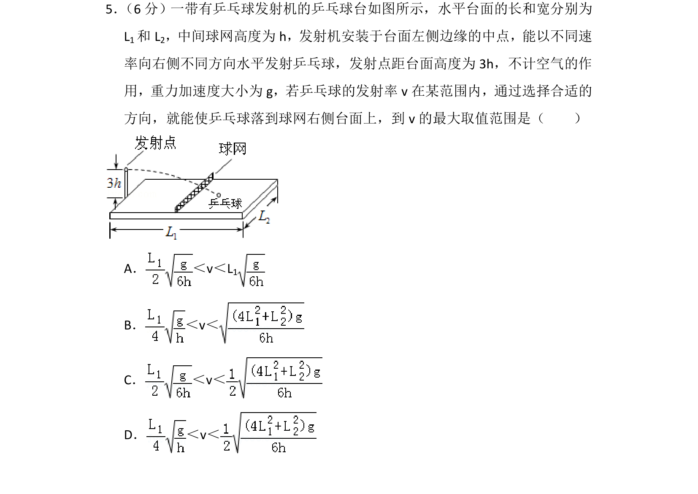
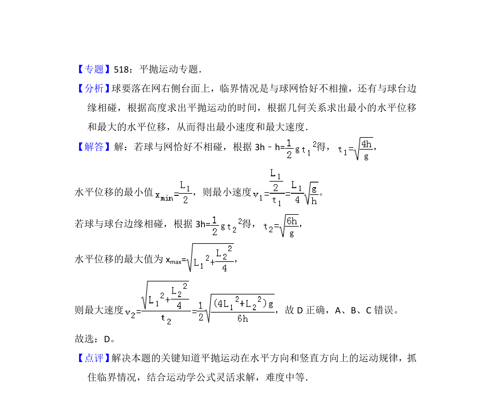

## 题面

## 摘要

乒乓球从台面左侧中点水平发射，通过平抛运动规律求落到右侧台面的速度范围。

## 关联考点

- [[261-平抛运动|平抛运动]]
- [[859-临界问题|临界问题]]
- [[速度范围]]

## 答案与解析

> 📄 原 PDF 第 5 页：`素材/真题/湖南/2008-2024·（湖南）物理高考真题/2015年高考物理试卷（新课标Ⅰ）（解析卷）.pdf`
