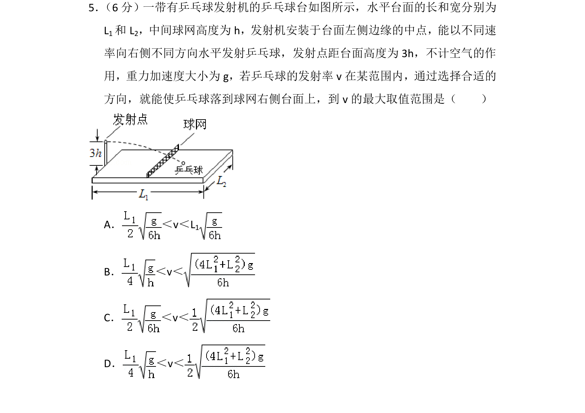
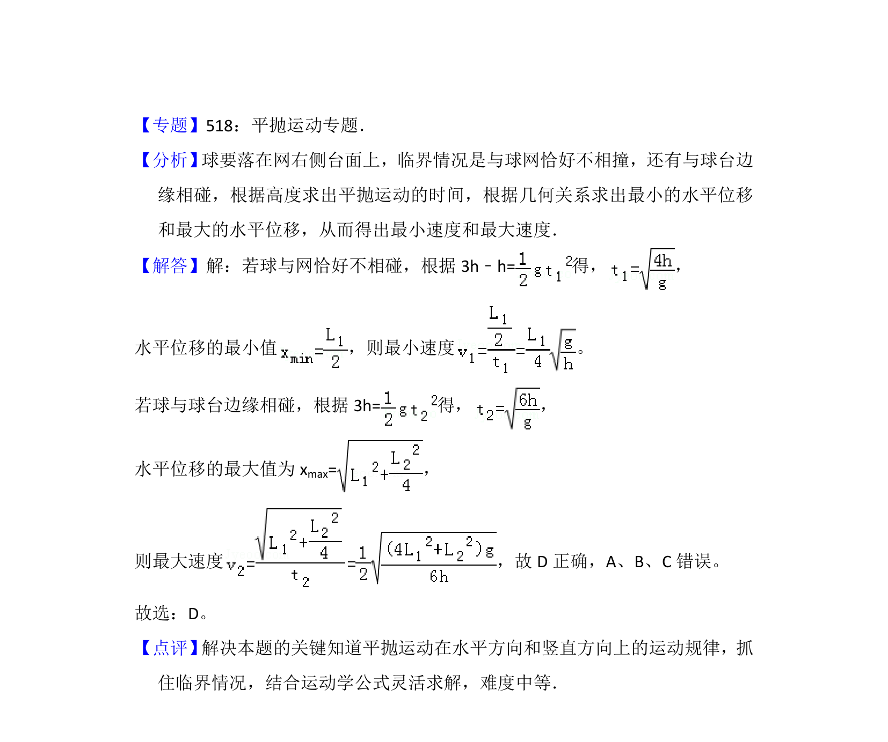

## 题面

## 摘要

乒乓球从台面左侧中点水平发射，通过平抛运动规律求落到右侧台面的速度范围。

## 关联考点

- [[261-平抛运动|平抛运动]]
- [[859-临界问题|临界问题]]
- [[速度范围]]

## 答案与解析

> 📄 原 PDF 第 5 页：`素材/真题/湖南/2008-2024·（湖南）物理高考真题/2015年高考物理试卷（新课标Ⅰ）（解析卷）.pdf`

<!-- 题干文本-start -->
## 题干文本
5． （6分）一带有乒乓球发射机的乒乓球台如图所示，水平台面的长和宽分别为
L1和L 2，中间球网高度为h，发射机安装于台面左侧边缘的中点，能以不同速
率向右侧不同方向水平发射乒乓球，发射点距台面高度为3h，不计空气的作
用，重力加速度大小为g，若乒乓球的发射率v在某范围内，通过选择合适的
方向，就能使乒乓球落到球网右侧台面上，到v的最大取值范围是（　　）
A． ＜v＜L 1
B． ＜v＜
C． ＜v＜
D． ＜v＜
<!-- 题干文本-end -->

<!-- 解析文本-start -->
## 解析文本
【考点】43：平抛运动．菁优网版权所有
<!-- 解析文本-end -->
