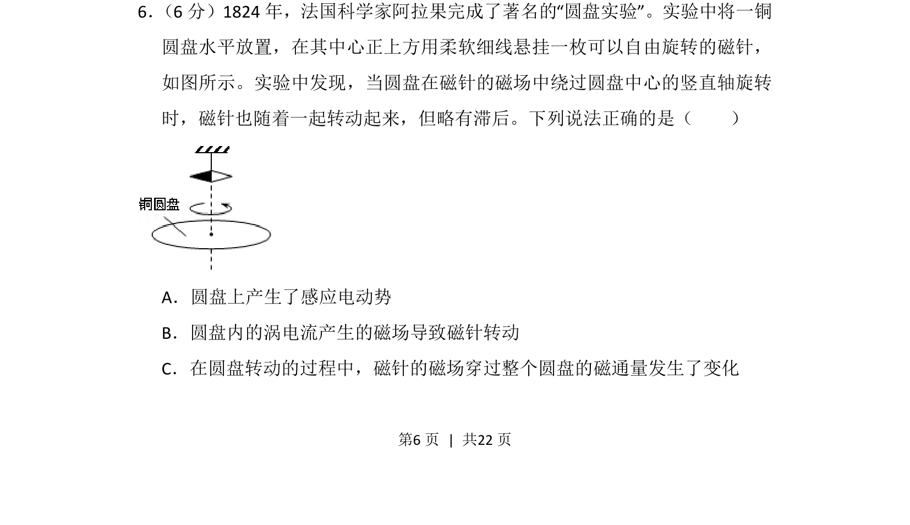
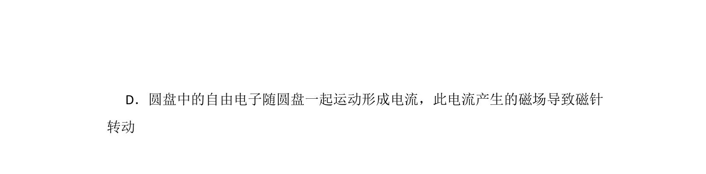
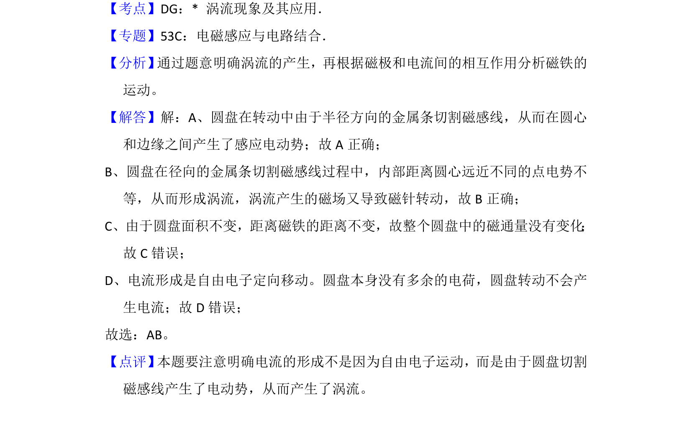

## 题面

## 摘要

圆盘在磁针磁场中旋转产生感应电动势和涡电流，涡电流磁场驱动磁针转动，并分析磁通量变化。

## 关联考点

- [[387-感应电动势|感应电动势]]
- [[651-涡电流|涡电流]]
- [[325-磁通量|磁通量]]
- [[电磁驱动]]

## 答案与解析

> 📄 原 PDF 第 6 页：`素材/真题/湖南/2008-2024·（湖南）物理高考真题/2015年高考物理试卷（新课标Ⅰ）（解析卷）.pdf`
