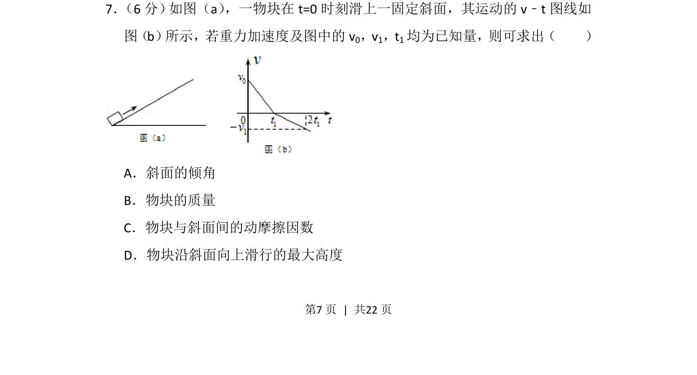
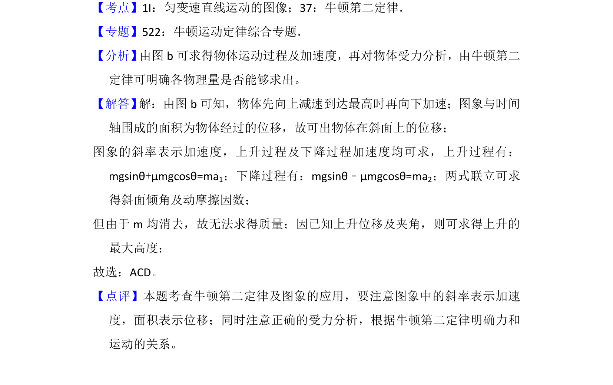

## 题面

## 摘要

通过v-t图像分析物块在斜面上的匀变速运动，判断可求解的物理量。

## 关联考点

- [[497-v-t图像|v-t图像]]
- [[229-牛顿第二定律|牛顿第二定律]]
- [[460-受力分析|受力分析]]
- [[215-匀变速直线运动|匀变速直线运动]]

## 答案与解析

> 📄 原 PDF 第 7 页：`素材/真题/湖南/2008-2024·（湖南）物理高考真题/2015年高考物理试卷（新课标Ⅰ）（解析卷）.pdf`
