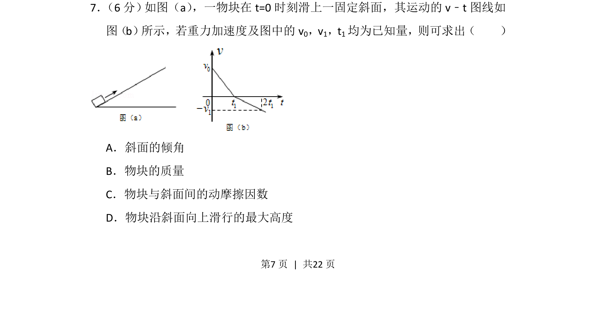
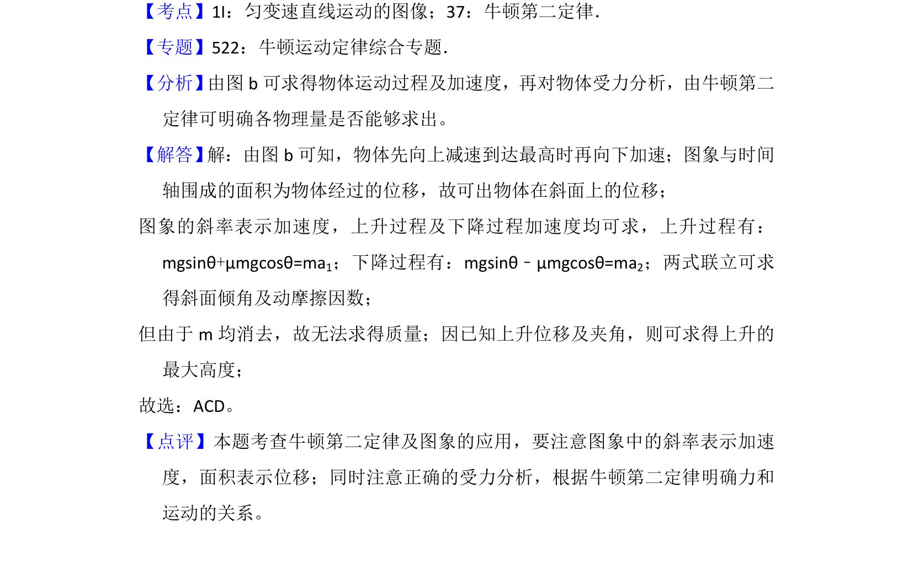

## 题面

## 摘要

通过v-t图像分析物块在斜面上的匀变速运动，判断可求解的物理量。

## 关联考点

- [[497-v-t图像|v-t图像]]
- [[229-牛顿第二定律|牛顿第二定律]]
- [[460-受力分析|受力分析]]
- [[215-匀变速直线运动|匀变速直线运动]]

## 答案与解析

> 📄 原 PDF 第 7 页：`素材/真题/湖南/2008-2024·（湖南）物理高考真题/2015年高考物理试卷（新课标Ⅰ）（解析卷）.pdf`

<!-- 题干文本-start -->
## 题干文本
7． （6分） 如图（a） ，一物块在t=0时刻滑上一固定斜面，其运动的v﹣t图线如
图（b） 所示，若重力加速度及图中的v0，v1，t1均为已知量，则可求出（　　）
A．斜面的倾角
B．物块的质量
C．物块与斜面间的动摩擦因数
D．物块沿斜面向上滑行的最大高度
<!-- 题干文本-end -->

<!-- 解析文本-start -->
## 解析文本

<!-- 解析文本-end -->
