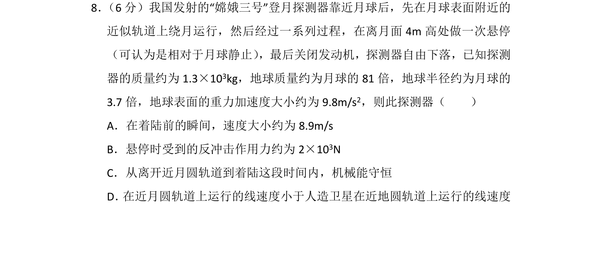
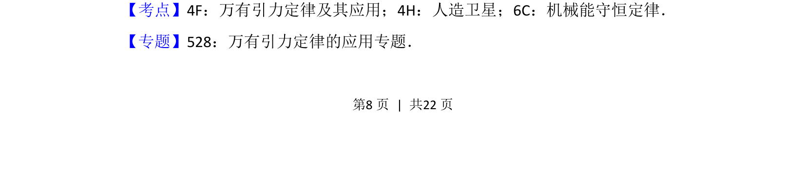
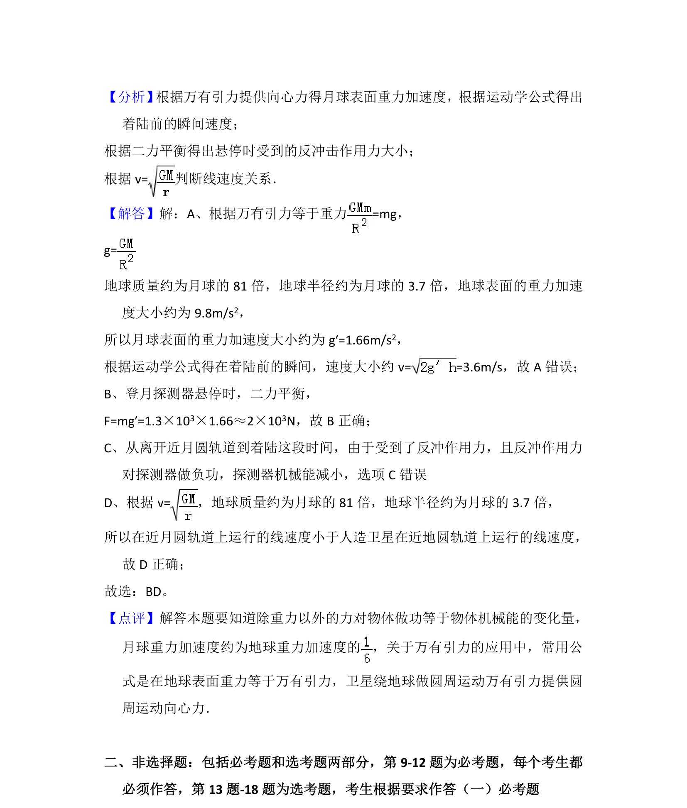

## 题面

## 摘要

探测器在月球表面悬停后自由下落，结合万有引力定律计算着陆速度、反冲力及轨道线速度比较。

## 关联考点

- [[834-万有引力定律及其应用|万有引力定律及其应用]]
- [[836-人造卫星|人造卫星]]
- [[085-机械能守恒-初中|机械能守恒定律]]

## 答案与解析

> 📄 原 PDF 第 8 页：`素材/真题/湖南/2008-2024·（湖南）物理高考真题/2015年高考物理试卷（新课标Ⅰ）（解析卷）.pdf`
