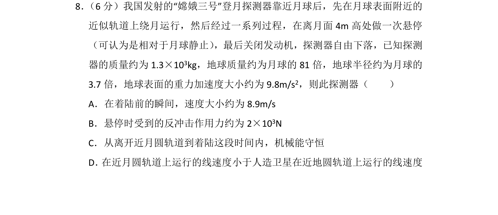
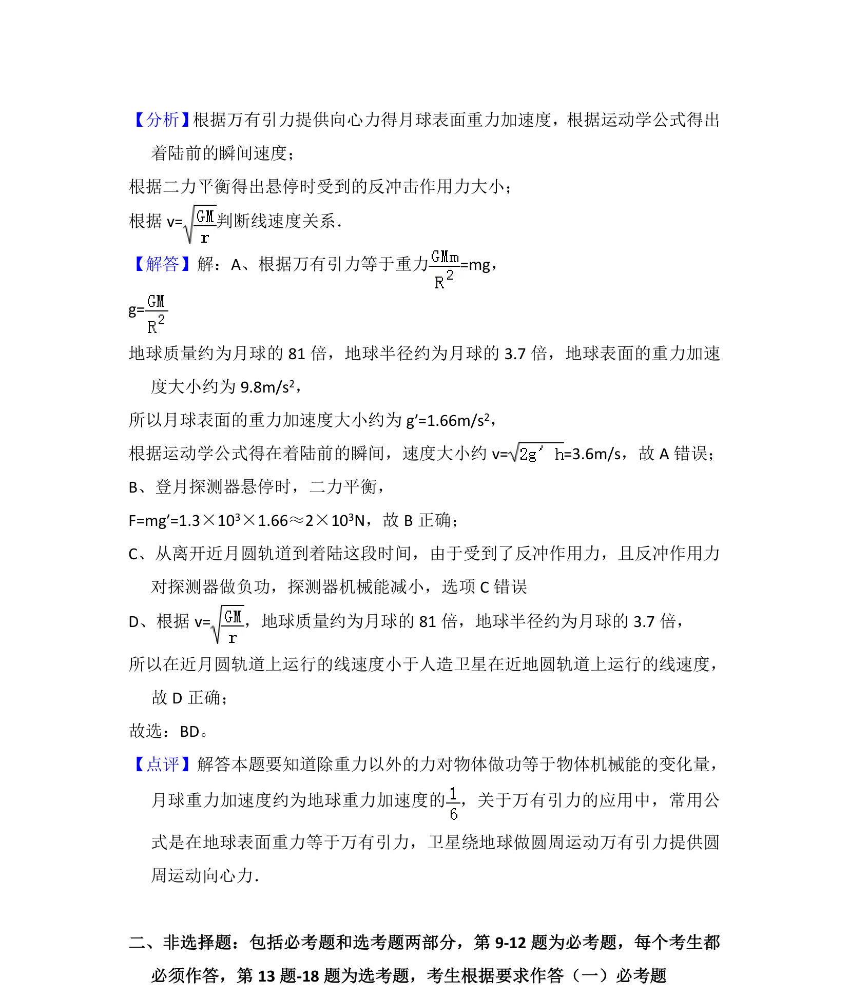

## 题面

## 摘要

探测器在月球表面悬停后自由下落，结合万有引力定律计算着陆速度、反冲力及轨道线速度比较。

## 关联考点

- [[834-万有引力定律及其应用|万有引力定律及其应用]]
- [[836-人造卫星|人造卫星]]
- [[085-机械能守恒-初中|机械能守恒定律]]

## 答案与解析

> 📄 原 PDF 第 8 页：`素材/真题/湖南/2008-2024·（湖南）物理高考真题/2015年高考物理试卷（新课标Ⅰ）（解析卷）.pdf`

<!-- 题干文本-start -->
## 题干文本
8． （6分）我国发射的“嫦娥三号”登月探测器靠近月球后，先在月球表面附近的
近似轨道上绕月运行，然后经过一系列过程，在离月面4m高处做一次悬停
（可认为是相对于月球静止） ，最后关闭发动机，探测器自由下落，已知探测
器的质量约为1.3×10 3kg，地球质量约为月球的81倍，地球半径约为月球的
3.7倍，地球表面的重力加速度大小约为9.8m/s 2，则此探测器（　　）
A．在着陆前的瞬间，速度大小约为8.9m/s
B．悬停时受到的反冲击作用力约为2×10 3N
C．从离开近月圆轨道到着陆这段时间内，机械能守恒
D． 在近月圆轨道上运行的线速度小于人造卫星在近地圆轨道上运行的线速度
<!-- 题干文本-end -->

<!-- 解析文本-start -->
## 解析文本
【考点】4F：万有引力定律及其应用；4H：人造卫星；6C：机械能守恒定律．菁优网版权所有
【专题】528：万有引力定律的应用专题．
<!-- 解析文本-end -->
