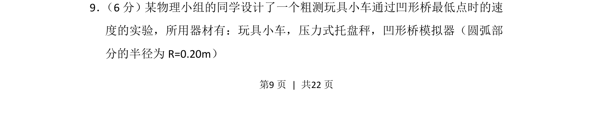
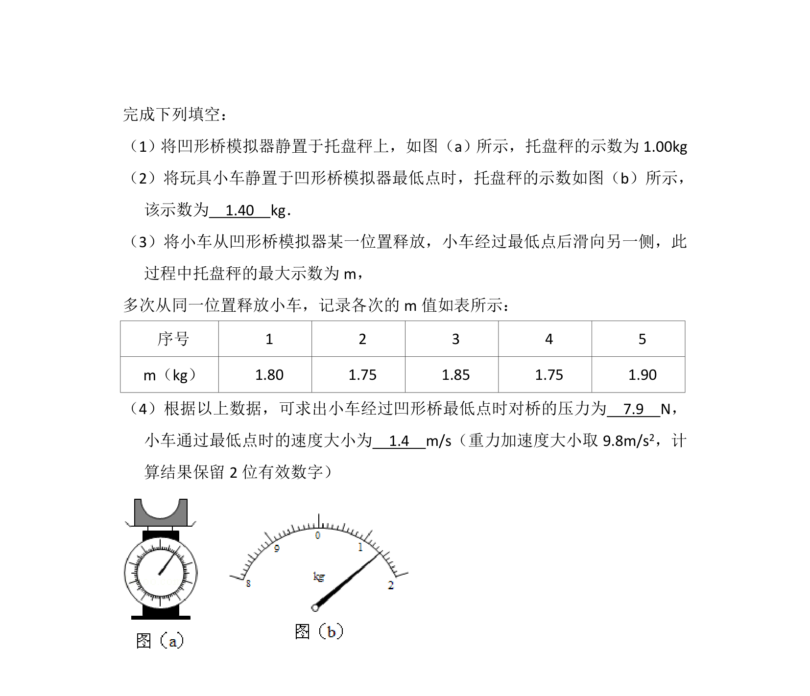
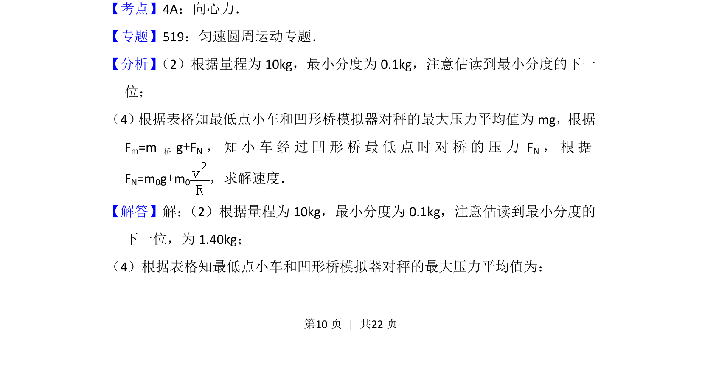
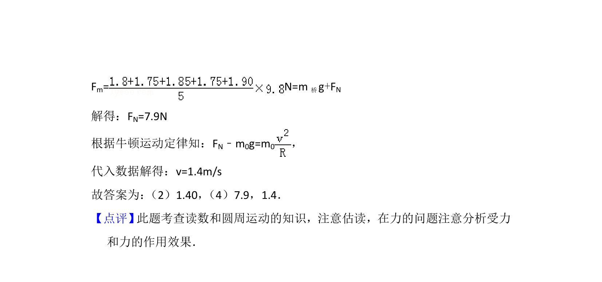

## 题面

## 摘要

粗测玩具小车通过凹形桥最低点速度的实验，涉及圆周运动向心力与牛顿第二定律。

## 关联考点

- [[258-圆周运动|圆周运动]]
- [[256-向心力|向心力]]
- [[229-牛顿第二定律|牛顿第二定律]]
- [[实验原理]]

## 答案与解析

> 📄 原 PDF 第 9 页：`素材/真题/湖南/2008-2024·（湖南）物理高考真题/2015年高考物理试卷（新课标Ⅰ）（解析卷）.pdf`
