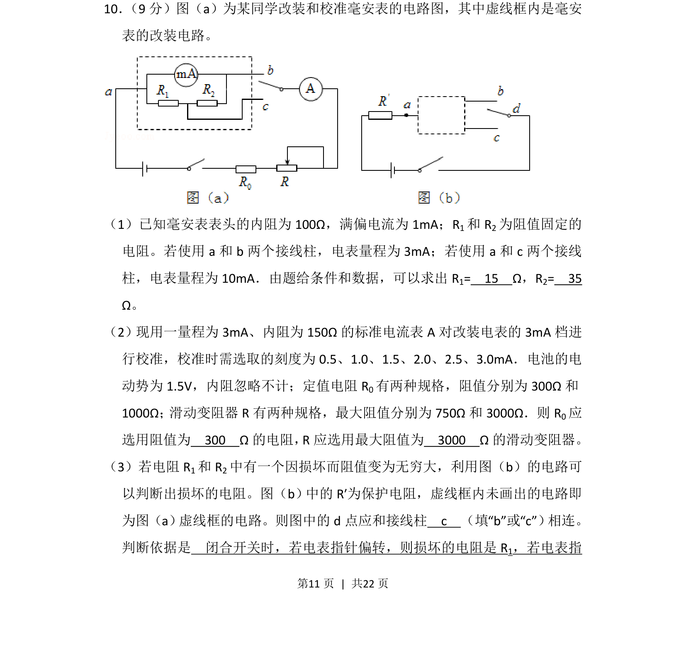
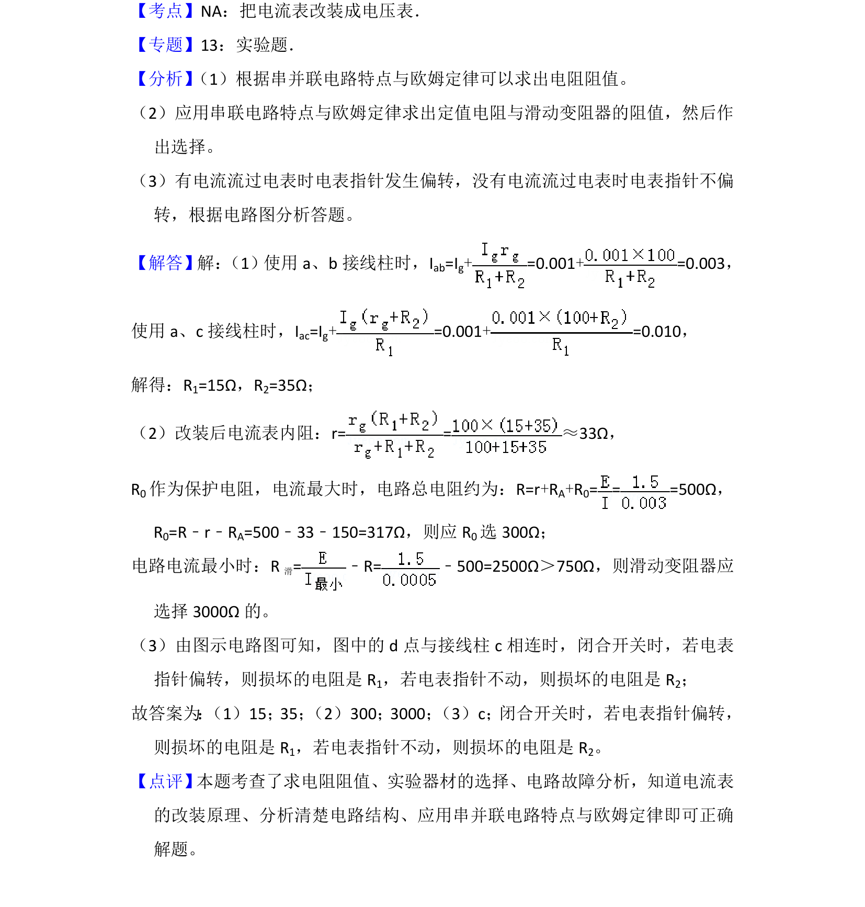

## 题面

## 摘要

改装电流表的量程计算、校准电路参数选择及故障判断方法。

## 关联考点

- [[683-电流表改装|电流表改装]]
- [[141-欧姆定律-初中|欧姆定律]]
- [[504-串并联电路|串并联电路]]
- [[电表校准]]

## 答案与解析

> 📄 原 PDF 第 11 页：`素材/真题/湖南/2008-2024·（湖南）物理高考真题/2015年高考物理试卷（新课标Ⅰ）（解析卷）.pdf`
