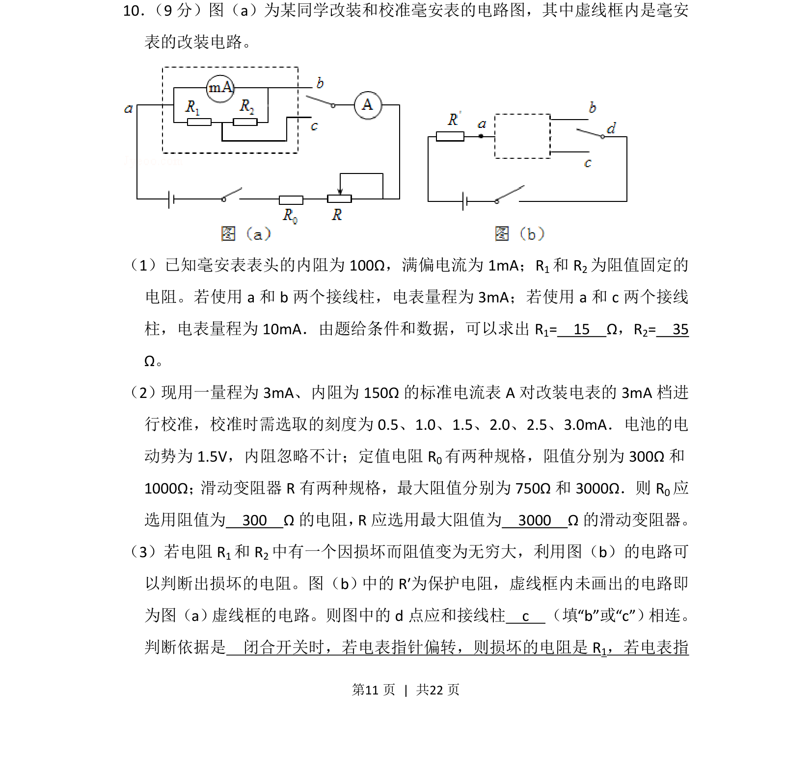
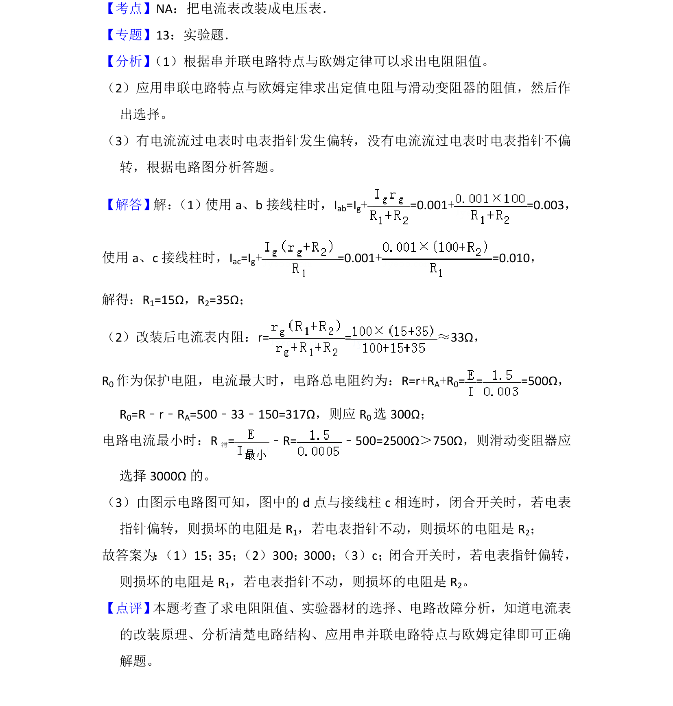

## 题面

## 摘要

改装电流表的量程计算、校准电路参数选择及故障判断方法。

## 关联考点

- [[683-电流表改装|电流表改装]]
- [[141-欧姆定律-初中|欧姆定律]]
- [[504-串并联电路|串并联电路]]
- [[电表校准]]

## 答案与解析

> 📄 原 PDF 第 11 页：`素材/真题/湖南/2008-2024·（湖南）物理高考真题/2015年高考物理试卷（新课标Ⅰ）（解析卷）.pdf`

<!-- 题干文本-start -->
## 题干文本
10． （9分）图（a）为某同学改装和校准毫安表的电路图，其中虚线框内是毫安
表的改装电路。
（1）已知毫安表表头的内阻为100Ω，满偏电流为1mA；R 1和R 2为阻值固定的
电阻。若使用a和b两个接线柱，电表量程为3mA；若使用a和c两个接线
柱，电表量程为10mA．由题给条件和数据，可以求出R 1=　15　Ω，R2=　35　
Ω。
（2）现用一量程为3mA、内阻为150Ω的标准电流表A对改装电表的3mA档进
行校准，校准时需选取的刻度为0.5、1.0、1.5、2.0、2.5、3.0mA．电池的电
动势为1.5V，内阻忽略不计；定值电阻R 0有两种规格，阻值分别为300Ω和
1000Ω； 滑动变阻器R有两种规格，最大阻值分别为750Ω和3000Ω．则R 0应
选用阻值为　300　Ω的电阻，R应选用最大阻值为　3000　Ω的滑动变阻器。
（3）若电阻R 1和R 2中有一个因损坏而阻值变为无穷大，利用图（b）的电路可
以判断出损坏的电阻。图（b）中的R′为保护电阻，虚线框内未画出的电路即
为图（a） 虚线框的电路。则图中的d点应和接线柱　c　（填“b”或“c”） 相连。
判断依据是　闭合开关时，若电表指针偏转，则损坏的电阻是R 1，若电表指
<!-- 题干文本-end -->

<!-- 解析文本-start -->
## 解析文本

<!-- 解析文本-end -->
