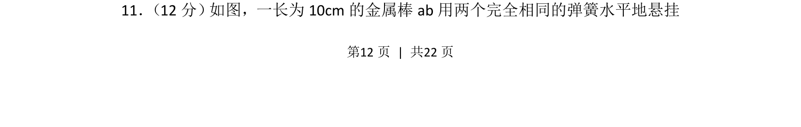
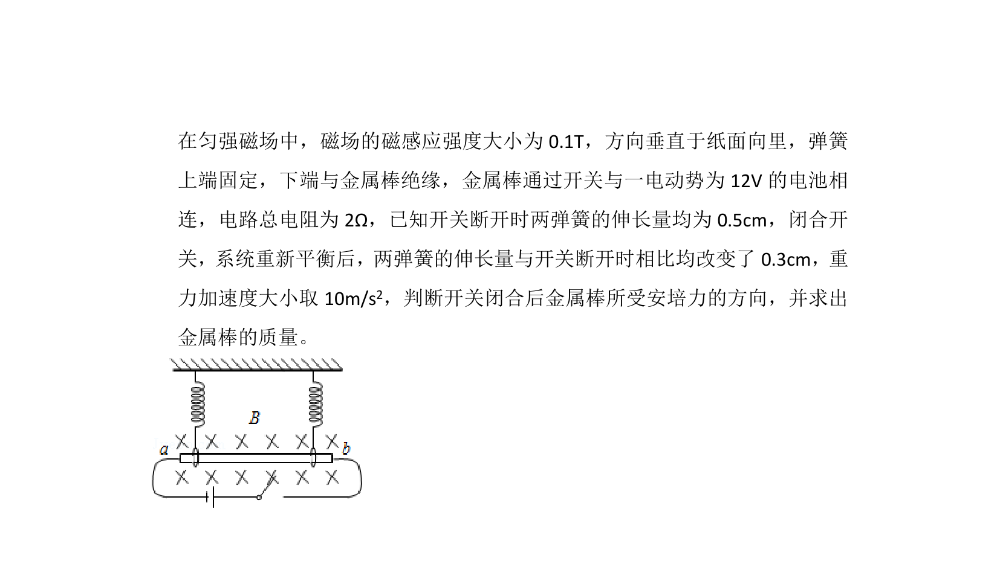
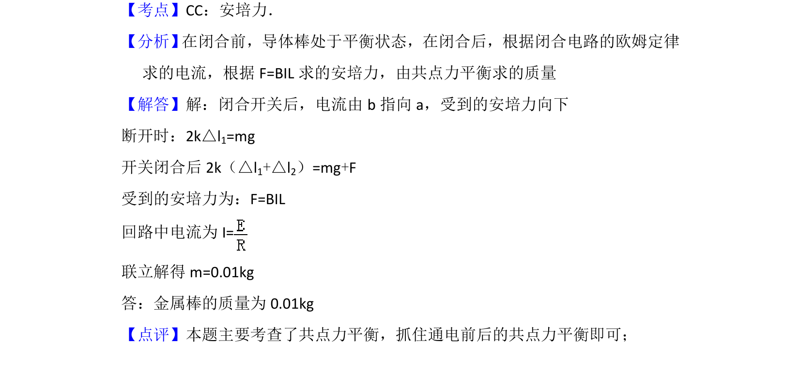

## 题面

## 摘要

金属棒在磁场中受安培力，结合弹簧弹力进行受力平衡分析

## 关联考点

- [[188-磁场对通电导体的作用|安培力]]
- [[233-胡克定律|胡克定律]]
- [[208-共点力平衡|共点力平衡]]

## 答案与解析

> 📄 原 PDF 第 12 页：`素材/真题/湖南/2008-2024·（湖南）物理高考真题/2015年高考物理试卷（新课标Ⅰ）（解析卷）.pdf`
