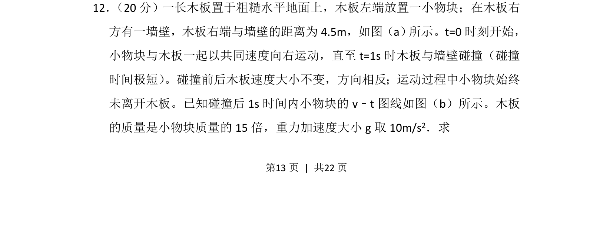
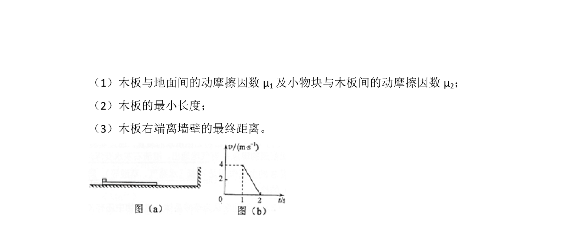
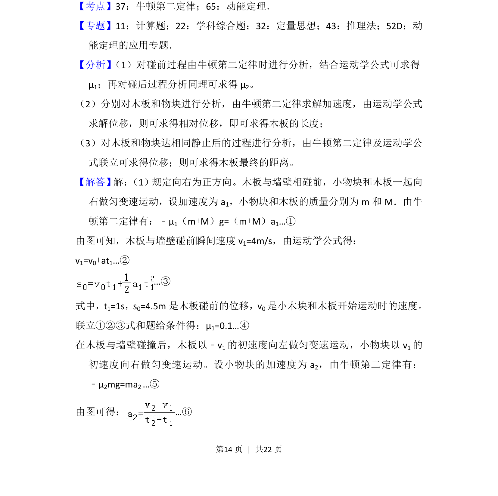
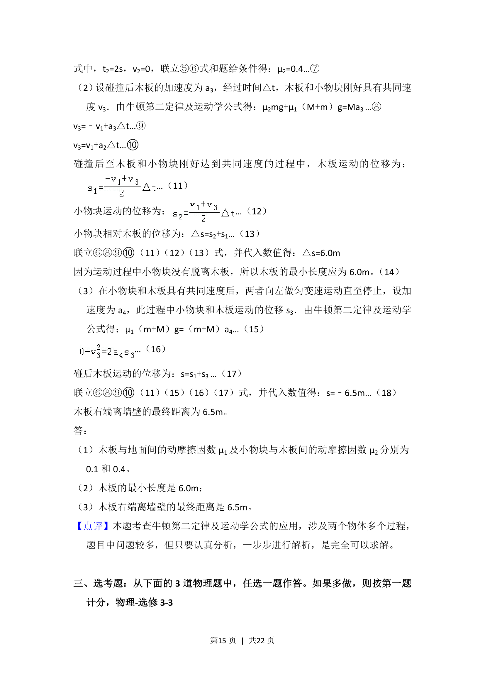

## 题面

## 摘要

木板与物块在粗糙水平面上运动并发生碰撞，结合v-t图像分析运动学、动力学及能量问题。

## 关联考点

- [[229-牛顿第二定律|牛顿第二定律]]
- [[215-匀变速直线运动|匀变速直线运动]]
- [[539-动量守恒|动量守恒]]
- [[081-摩擦力|摩擦力]]

## 答案与解析

> 📄 原 PDF 第 13 页：`素材/真题/湖南/2008-2024·（湖南）物理高考真题/2015年高考物理试卷（新课标Ⅰ）（解析卷）.pdf`
