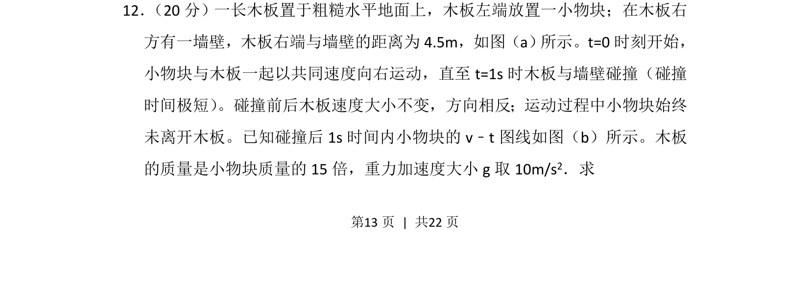
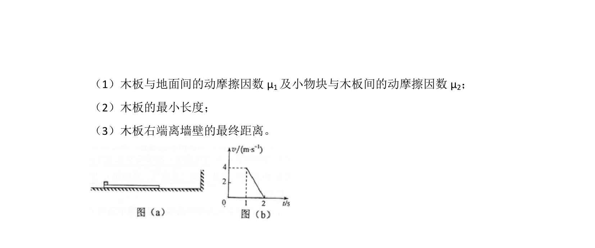
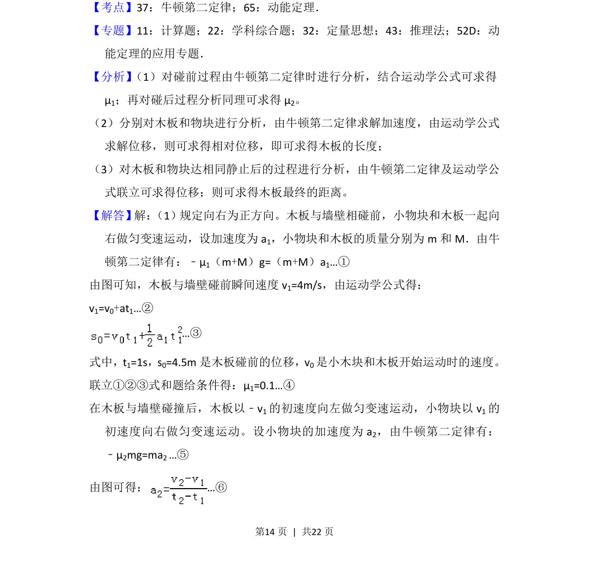
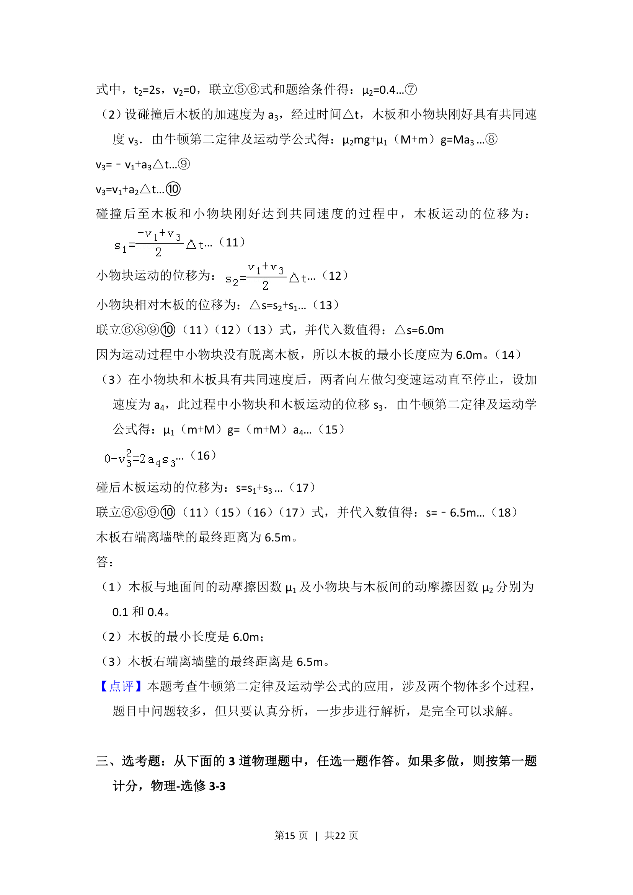

## 题面

## 摘要

木板与物块在粗糙水平面上运动并发生碰撞，结合v-t图像分析运动学、动力学及能量问题。

## 关联考点

- [[229-牛顿第二定律|牛顿第二定律]]
- [[215-匀变速直线运动|匀变速直线运动]]
- [[539-动量守恒|动量守恒]]
- [[081-摩擦力|摩擦力]]

## 答案与解析

> 📄 原 PDF 第 13 页：`素材/真题/湖南/2008-2024·（湖南）物理高考真题/2015年高考物理试卷（新课标Ⅰ）（解析卷）.pdf`

<!-- 题干文本-start -->
## 题干文本
12． （20分）一长木板置于粗糙水平地面上，木板左端放置一小物块；在木板右
方有一墙壁，木板右端与墙壁的距离为4.5m，如图（a） 所示。t=0时刻开始，
小物块与木板一起以共同速度向右运动，直至t=1s时木板与墙壁碰撞（碰撞
时间极短） 。碰撞前后木板速度大小不变，方向相反；运动过程中小物块始终
未离开木板。已知碰撞后1s时间内小物块的v﹣t图线如图（b）所示。木板
的质量是小物块质量的15倍，重力加速度大小g取10m/s 2．求
<!-- 题干文本-end -->

<!-- 解析文本-start -->
## 解析文本

<!-- 解析文本-end -->
