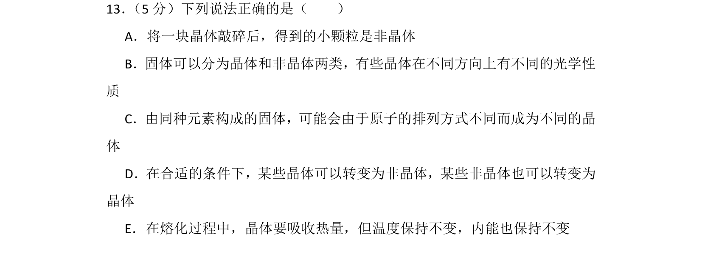
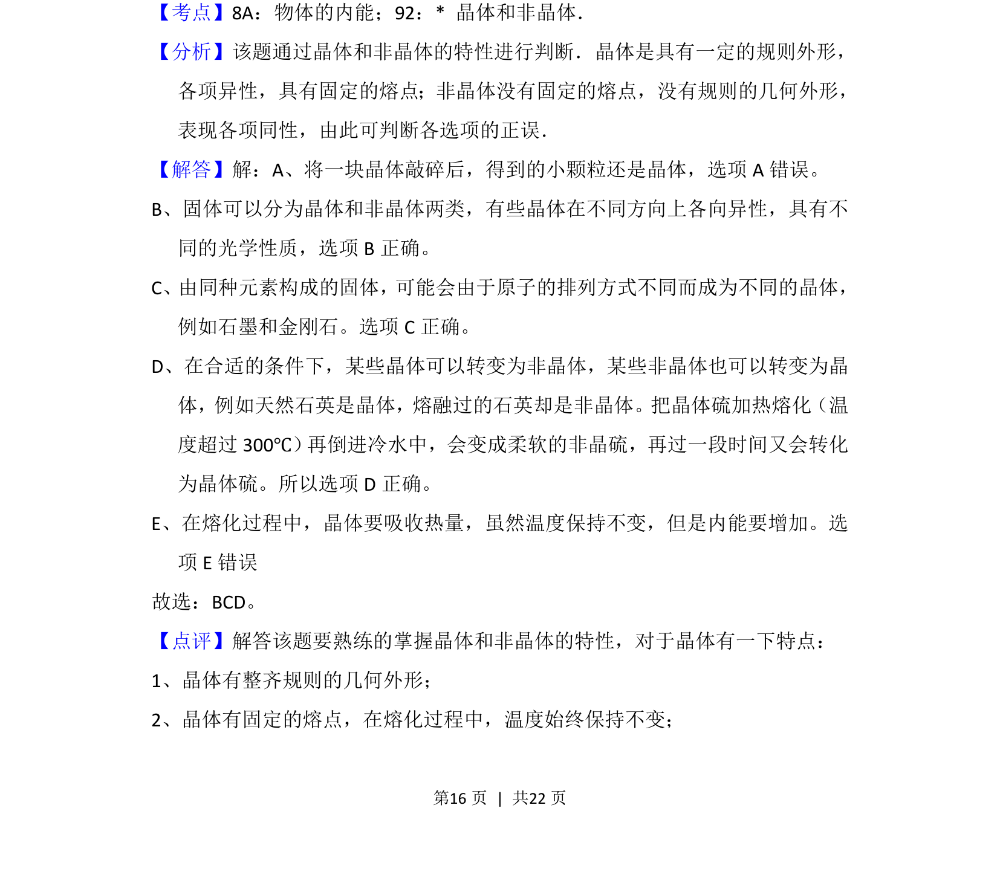
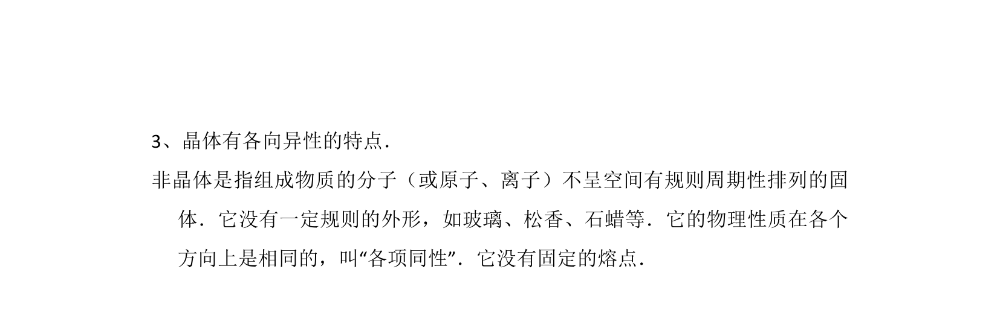

## 题面

## 摘要

本题考查晶体和非晶体的特性，包括各向异性、原子排列、晶体与非晶体的相互转化以及熔化过程内能变化。

## 关联考点

- [[409-晶体|晶体]]
- [[非晶体]]
- [[127-内能|内能]]
- [[039-熔化与凝固|熔化]]

## 答案与解析

> 📄 原 PDF 第 16 页：`素材/真题/湖南/2008-2024·（湖南）物理高考真题/2015年高考物理试卷（新课标Ⅰ）（解析卷）.pdf`
