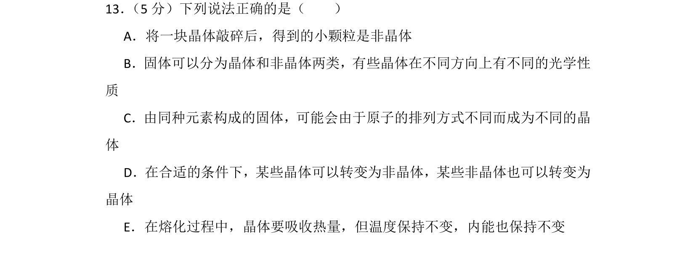
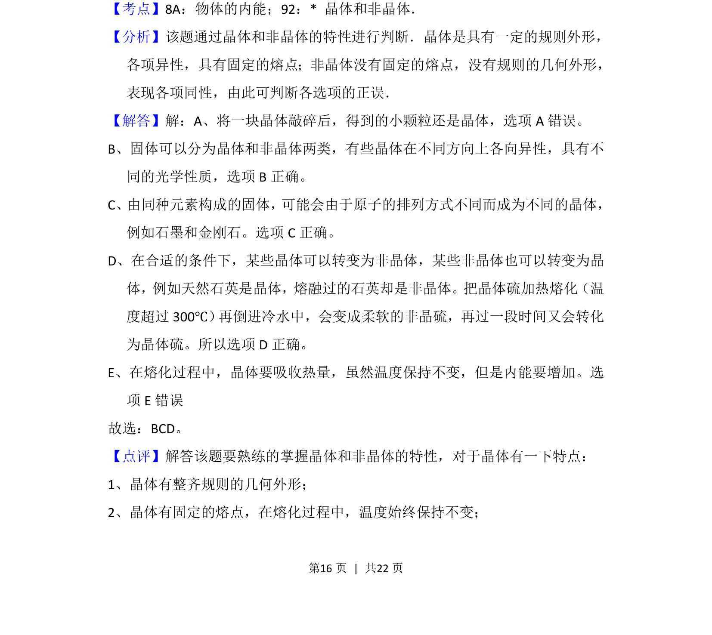
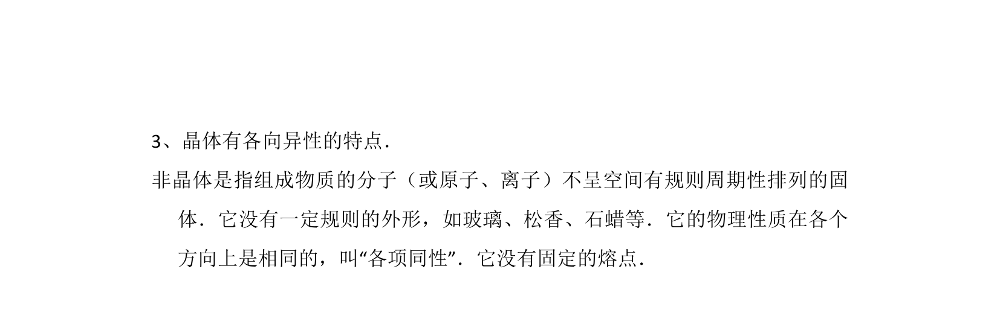

## 题面

## 摘要

本题考查晶体和非晶体的特性，包括各向异性、原子排列、晶体与非晶体的相互转化以及熔化过程内能变化。

## 关联考点

- [[409-晶体|晶体]]
- [[非晶体]]
- [[127-内能|内能]]
- [[039-熔化与凝固|熔化]]

## 答案与解析

> 📄 原 PDF 第 16 页：`素材/真题/湖南/2008-2024·（湖南）物理高考真题/2015年高考物理试卷（新课标Ⅰ）（解析卷）.pdf`

<!-- 题干文本-start -->
## 题干文本
13． （5分）下列说法正确的是（　　）
A．将一块晶体敲碎后，得到的小颗粒是非晶体
B．固体可以分为晶体和非晶体两类，有些晶体在不同方向上有不同的光学性
质
C．由同种元素构成的固体，可能会由于原子的排列方式不同而成为不同的晶
体
D．在合适的条件下，某些晶体可以转变为非晶体，某些非晶体也可以转变为
晶体
E．在熔化过程中，晶体要吸收热量，但温度保持不变，内能也保持不变
<!-- 题干文本-end -->

<!-- 解析文本-start -->
## 解析文本
【考点】8A：物体的内能；92：* 晶体和非晶体．菁优网版权所有
【分析】该题通过晶体和非晶体的特性进行判断．晶体是具有一定的规则外形，
各项异性，具有固定的熔点；非晶体没有固定的熔点，没有规则的几何外形，
表现各项同性，由此可判断各选项的正误．
【解答】解：A、将一块晶体敲碎后，得到的小颗粒还是晶体，选项A错误。
B、固体可以分为晶体和非晶体两类，有些晶体在不同方向上各向异性，具有不
同的光学性质，选项B正确。
C、由同种元素构成的固体，可能会由于原子的排列方式不同而成为不同的晶体，
例如石墨和金刚石。选项C正确。
D、在合适的条件下，某些晶体可以转变为非晶体，某些非晶体也可以转变为晶
体，例如天然石英是晶体，熔融过的石英却是非晶体。把晶体硫加热熔化（温
度超过300℃） 再倒进冷水中，会变成柔软的非晶硫，再过一段时间又会转化
为晶体硫。所以选项D正确。
E、在熔化过程中，晶体要吸收热量，虽然温度保持不变，但是内能要增加。选
项E错误
故选：BCD。
【点评】解答该题要熟练的掌握晶体和非晶体的特性，对于晶体有一下特点：
1、晶体有整齐规则的几何外形；
2、晶体有固定的熔点，在熔化过程中，温度始终保持不变；
<!-- 解析文本-end -->
