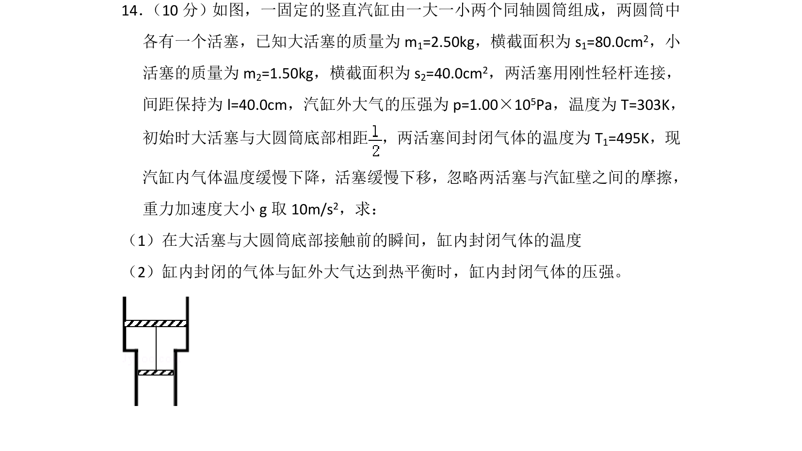
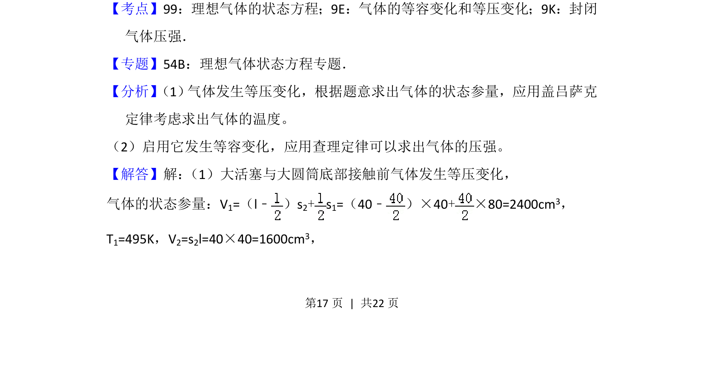
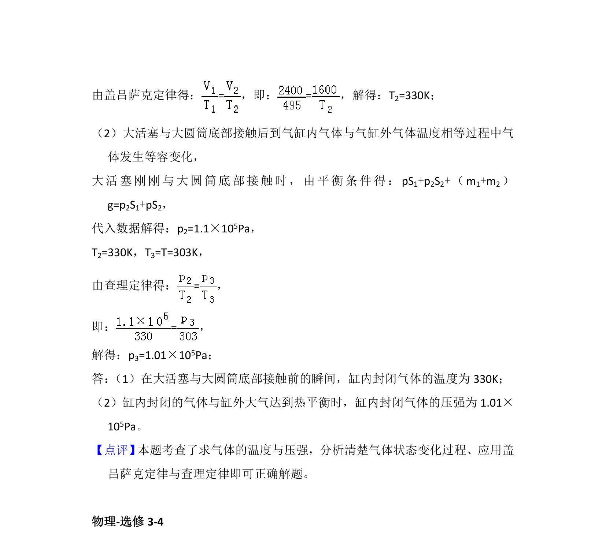

## 题面

## 摘要

两活塞连接的气缸中气体经历等压降温后等容变化，求末温和末压强。

## 关联考点

- [[483-理想气体的状态方程|理想气体的状态方程]]
- [[气体的等容变化和等压变化]]
- [[591-封闭气体压强|封闭气体压强]]

## 答案与解析

> 📄 原 PDF 第 17 页：`素材/真题/湖南/2008-2024·（湖南）物理高考真题/2015年高考物理试卷（新课标Ⅰ）（解析卷）.pdf`
