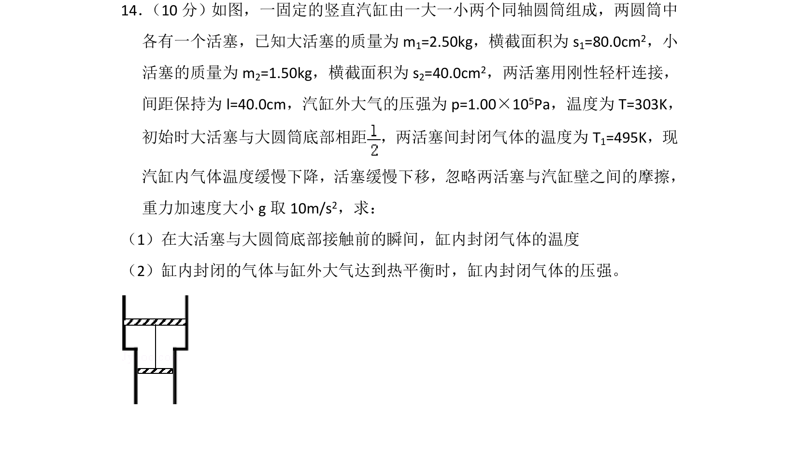
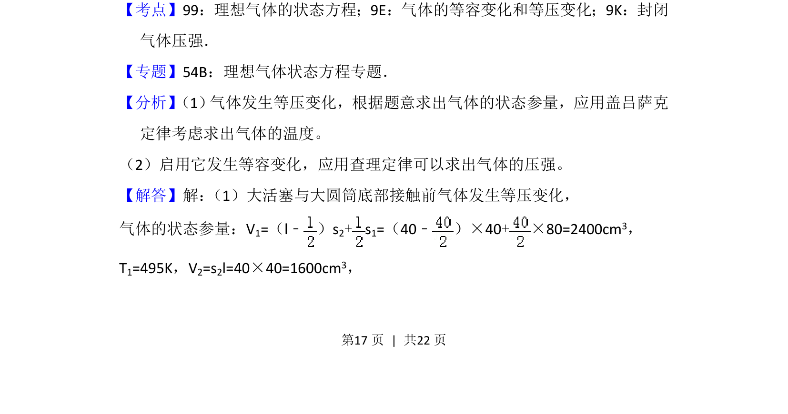
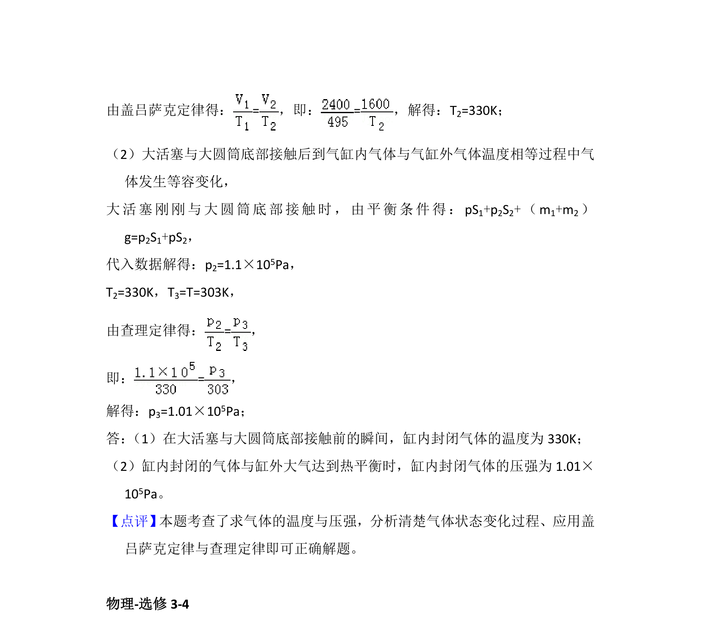

## 题面

## 摘要

两活塞连接的气缸中气体经历等压降温后等容变化，求末温和末压强。

## 关联考点

- [[446-理想气体状态方程|理想气体的状态方程]]
- [[气体的等容变化和等压变化]]
- [[591-封闭气体压强|封闭气体压强]]

## 答案与解析

> 📄 原 PDF 第 17 页：`素材/真题/湖南/2008-2024·（湖南）物理高考真题/2015年高考物理试卷（新课标Ⅰ）（解析卷）.pdf`

<!-- 题干文本-start -->
## 题干文本
14． （10分）如图，一固定的竖直汽缸由一大一小两个同轴圆筒组成，两圆筒中
各有一个活塞，已知大活塞的质量为m 1=2.50kg，横截面积为s 1=80.0cm2，小
活塞的质量为m 2=1.50kg，横截面积为s 2=40.0cm2，两活塞用刚性轻杆连接，
间距保持为l=40.0cm，汽缸外大气的压强为p=1.00×10 5Pa，温度为T=303K，
初始时大活塞与大圆筒底部相距 ，两活塞间封闭气体的温度为T 1=495K，现
汽缸内气体温度缓慢下降，活塞缓慢下移，忽略两活塞与汽缸壁之间的摩擦，
重力加速度大小g取10m/s 2，求：
（1）在大活塞与大圆筒底部接触前的瞬间，缸内封闭气体的温度
（2）缸内封闭的气体与缸外大气达到热平衡时，缸内封闭气体的压强。
<!-- 题干文本-end -->

<!-- 解析文本-start -->
## 解析文本
【考点】99：理想气体的状态方程；9E：气体的等容变化和等压变化；9K：封闭
气体压强．菁优网版权所有
【专题】54B：理想气体状态方程专题．
【分析】 （1） 气体发生等压变化，根据题意求出气体的状态参量，应用盖吕萨克
定律考虑求出气体的温度。
（2）启用它发生等容变化，应用查理定律可以求出气体的压强。
【解答】解： （1）大活塞与大圆筒底部接触前气体发生等压变化，
气体的状态参量：V1=（l﹣）s 2+s 1=（40﹣）×40+ ×80=2400cm 3，
T1=495K，V2=s2l=40×40=1600cm3，
<!-- 解析文本-end -->
