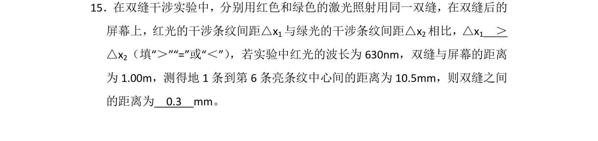
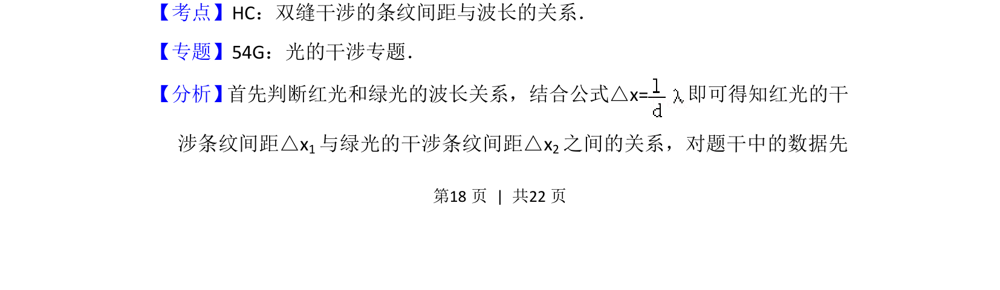
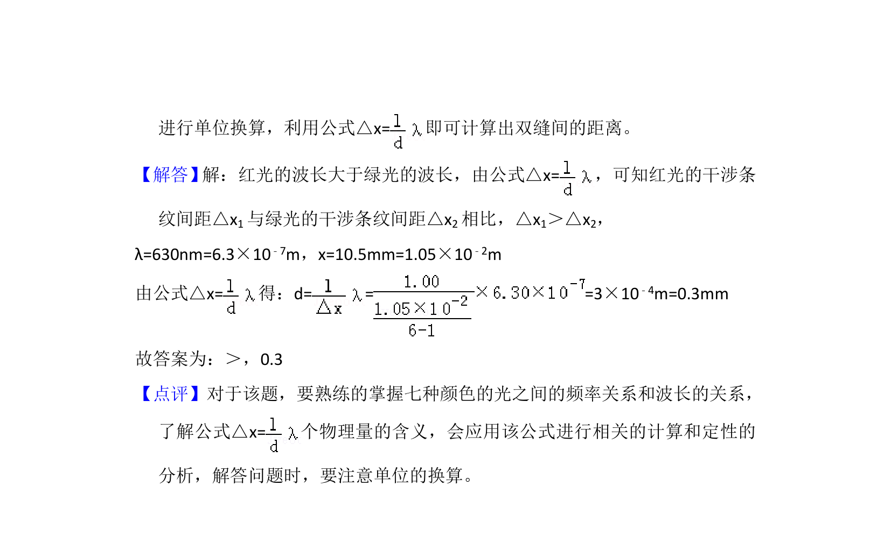

## 题面

## 摘要

该题考查红光与绿光在双缝干涉中条纹间距的比较及利用条纹间距公式计算双缝距离。

## 关联考点

- [[552-双缝干涉|双缝干涉]]
- [[627-条纹间距|条纹间距]]
- [[370-波长|波长]]
- [[公式应用]]

## 答案与解析

> 📄 原 PDF 第 18 页：`素材/真题/湖南/2008-2024·（湖南）物理高考真题/2015年高考物理试卷（新课标Ⅰ）（解析卷）.pdf`
