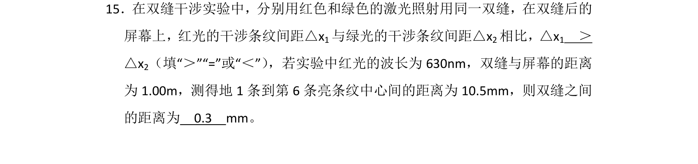
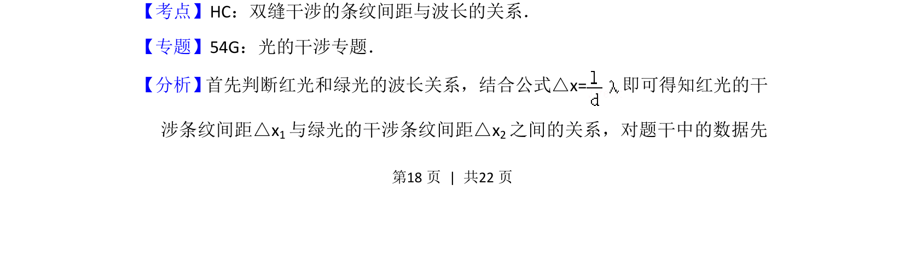
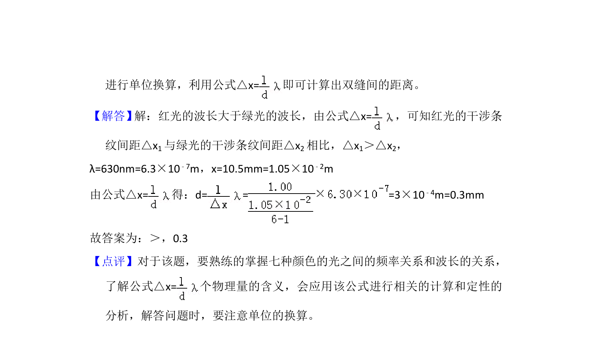

## 题面

## 摘要

该题考查红光与绿光在双缝干涉中条纹间距的比较及利用条纹间距公式计算双缝距离。

## 关联考点

- [[552-双缝干涉|双缝干涉]]
- [[627-条纹间距|条纹间距]]
- [[370-波长|波长]]
- [[公式应用]]

## 答案与解析

> 📄 原 PDF 第 18 页：`素材/真题/湖南/2008-2024·（湖南）物理高考真题/2015年高考物理试卷（新课标Ⅰ）（解析卷）.pdf`

<!-- 题干文本-start -->
## 题干文本
15．在双缝干涉实验中，分别用红色和绿色的激光照射用同一双缝，在双缝后的
屏幕上，红光的干涉条纹间距△x1与绿光的干涉条纹间距△x2相比，△x1　＞　
△x2（填“＞”“=”或“＜”） ，若实验中红光的波长为630nm，双缝与屏幕的距离
为1.00m，测得地1条到第6条亮条纹中心间的距离为10.5mm，则双缝之间
的距离为　0.3　mm。
<!-- 题干文本-end -->

<!-- 解析文本-start -->
## 解析文本
【考点】HC：双缝干涉的条纹间距与波长的关系．菁优网版权所有
【专题】54G：光的干涉专题．
【分析】 首先判断红光和绿光的波长关系，结合公式△x=即可得知红光的干
涉条纹间距△x 1与绿光的干涉条纹间距△x 2之间的关系，对题干中的数据先
<!-- 解析文本-end -->
