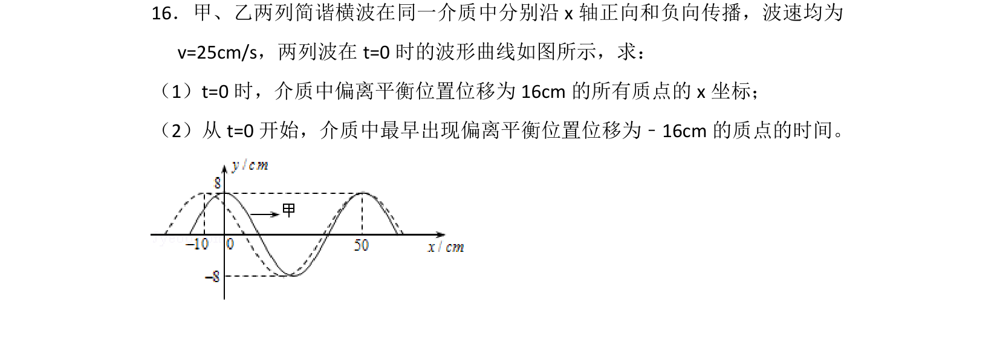
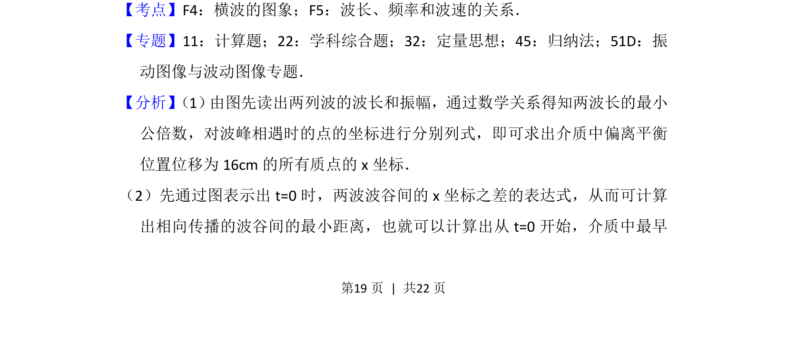
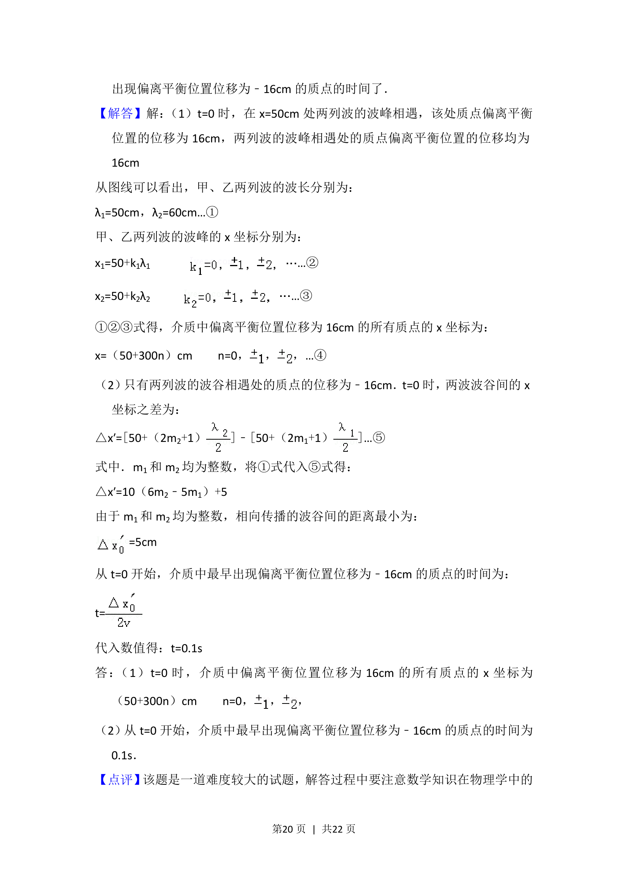
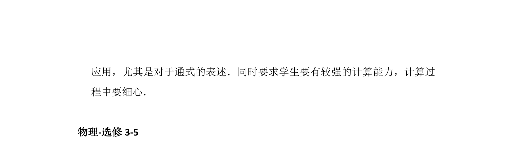

## 题面

## 摘要

两列简谐横波叠加，求特定位移质点的坐标及最早出现特定位移的时间。

## 关联考点

- [[630-横波的图象|横波的图象]]
- [[648-波长频率和波速的关系|波长频率和波速的关系]]
- [[645-波的叠加|波的叠加]]

## 答案与解析

> 📄 原 PDF 第 19 页：`素材/真题/湖南/2008-2024·（湖南）物理高考真题/2015年高考物理试卷（新课标Ⅰ）（解析卷）.pdf`

<!-- 题干文本-start -->
## 题干文本
16．甲、乙两列简谐横波在同一介质中分别沿x轴正向和负向传播，波速均为
v=25cm/s，两列波在t=0时的波形曲线如图所示，求：
（1）t=0时，介质中偏离平衡位置位移为16cm的所有质点的x坐标；
（2）从t=0开始，介质中最早出现偏离平衡位置位移为﹣16cm的质点的时间。
<!-- 题干文本-end -->

<!-- 解析文本-start -->
## 解析文本
【考点】F4：横波的图象；F5：波长、频率和波速的关系．菁优网版权所有
【专题】11：计算题；22：学科综合题；32：定量思想；45：归纳法；51D：振
动图像与波动图像专题．
【分析】 （1） 由图先读出两列波的波长和振幅，通过数学关系得知两波长的最小
公倍数，对波峰相遇时的点的坐标进行分别列式，即可求出介质中偏离平衡
位置位移为16cm的所有质点的x坐标．
（2）先通过图表示出t=0时，两波波谷间的x坐标之差的表达式，从而可计算
出相向传播的波谷间的最小距离，也就可以计算出从t=0开始，介质中最早
<!-- 解析文本-end -->
