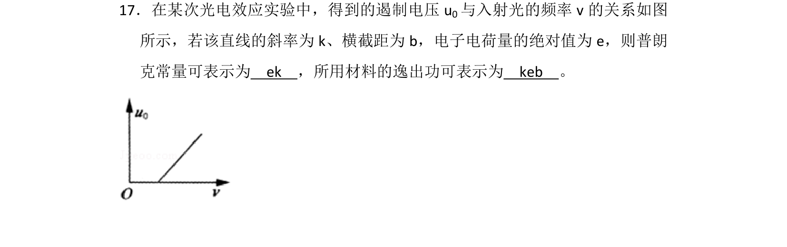
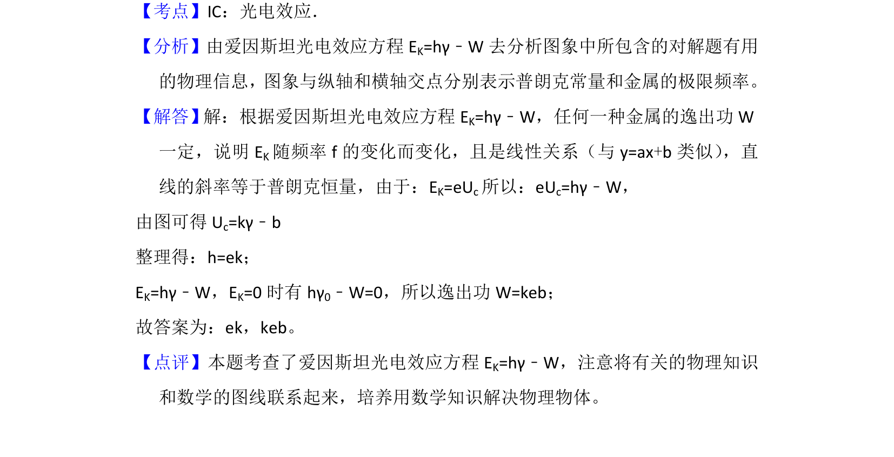

## 题面

## 摘要

该题根据光电效应实验中遏制电压与入射光频率的关系图象，求解普朗克常量和逸出功。

## 关联考点

- [[660-爱因斯坦光电效应方程|爱因斯坦光电效应方程]]
- [[遏制电压]]
- [[普朗克常量]]
- [[745-逸出功|逸出功]]

## 答案与解析

> 📄 原 PDF 第 21 页：`素材/真题/湖南/2008-2024·（湖南）物理高考真题/2015年高考物理试卷（新课标Ⅰ）（解析卷）.pdf`
