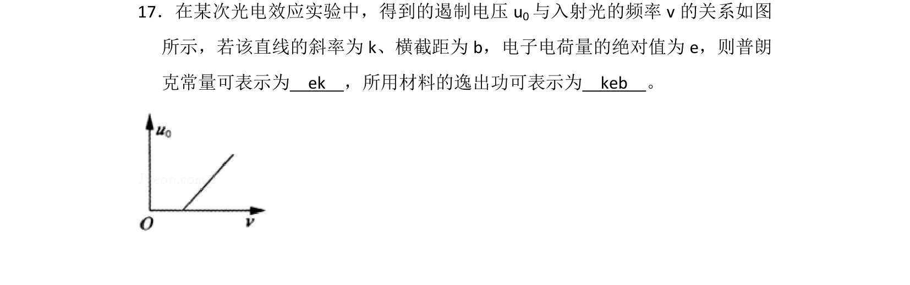
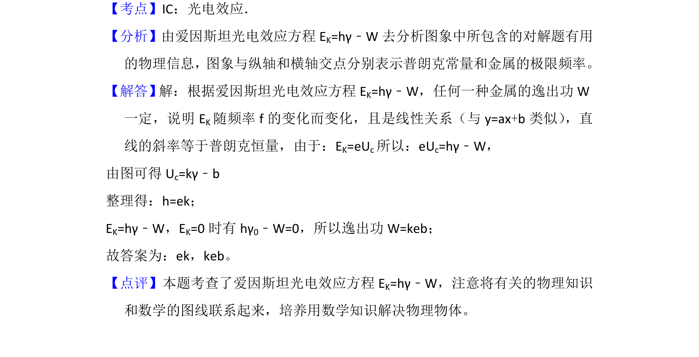

## 题面

## 摘要

该题根据光电效应实验中遏制电压与入射光频率的关系图象，求解普朗克常量和逸出功。

## 关联考点

- [[660-爱因斯坦光电效应方程|爱因斯坦光电效应方程]]
- [[遏制电压]]
- [[普朗克常量]]
- [[745-逸出功|逸出功]]

## 答案与解析

> 📄 原 PDF 第 21 页：`素材/真题/湖南/2008-2024·（湖南）物理高考真题/2015年高考物理试卷（新课标Ⅰ）（解析卷）.pdf`

<!-- 题干文本-start -->
## 题干文本
17．在某次光电效应实验中，得到的遏制电压u 0与入射光的频率v的关系如图
所示，若该直线的斜率为k、横截距为b，电子电荷量的绝对值为e，则普朗
克常量可表示为　ek　，所用材料的逸出功可表示为　keb　。
<!-- 题干文本-end -->

<!-- 解析文本-start -->
## 解析文本
【考点】IC：光电效应．菁优网版权所有
【分析】由爱因斯坦光电效应方程E K=hγ﹣W去分析图象中所包含的对解题有用
的物理信息，图象与纵轴和横轴交点分别表示普朗克常量和金属的极限频率。
【解答】解：根据爱因斯坦光电效应方程EK=hγ﹣W，任何一种金属的逸出功W
一定，说明E K随频率f的变化而变化，且是线性关系（与y=ax+b类似） ，直
线的斜率等于普朗克恒量，由于：EK=eUc所以：eUc=hγ﹣W，
由图可得U c=kγ﹣b
整理得：h=ek；
EK=hγ﹣W，EK=0时有hγ 0﹣W=0，所以逸出功W=keb；
故答案为：ek，keb。
【点评】本题考查了爱因斯坦光电效应方程E K=hγ﹣W，注意将有关的物理知识
和数学的图线联系起来，培养用数学知识解决物理物体。
<!-- 解析文本-end -->
