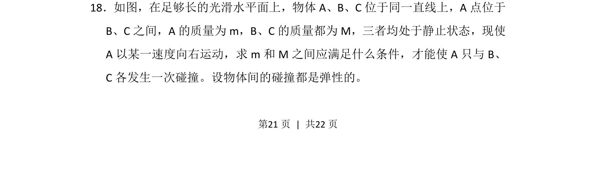
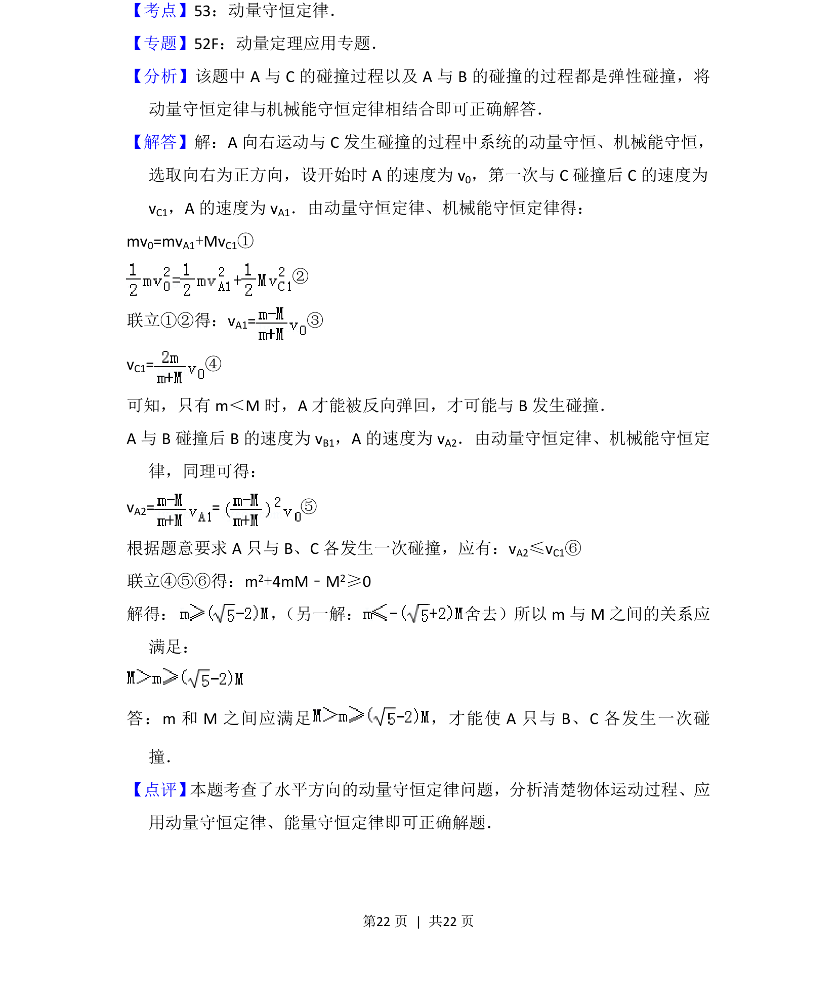

## 题面

## 摘要

A 与 B、C 弹性碰撞，求仅各碰一次的质量条件。

## 关联考点

- [[359-弹性碰撞|弹性碰撞]]
- [[539-动量守恒|动量守恒]]
- [[085-机械能守恒-初中|机械能守恒]]

## 答案与解析

> 📄 原 PDF 第 21 页：`素材/真题/湖南/2008-2024·（湖南）物理高考真题/2015年高考物理试卷（新课标Ⅰ）（解析卷）.pdf`
