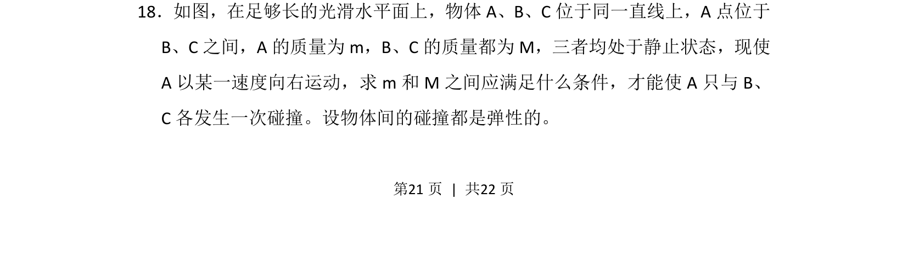
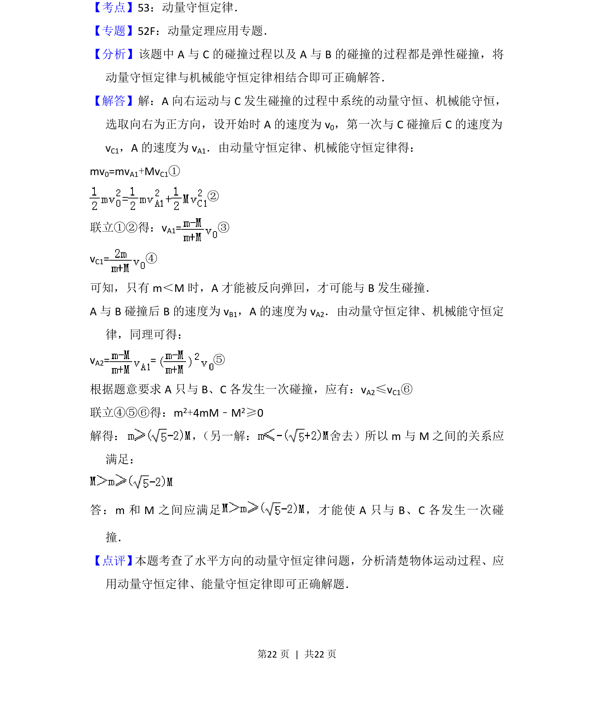

## 题面

## 摘要

A 与 B、C 弹性碰撞，求仅各碰一次的质量条件。

## 关联考点

- [[359-弹性碰撞|弹性碰撞]]
- [[539-动量守恒|动量守恒]]
- [[085-机械能守恒-初中|机械能守恒]]

## 答案与解析

> 📄 原 PDF 第 21 页：`素材/真题/湖南/2008-2024·（湖南）物理高考真题/2015年高考物理试卷（新课标Ⅰ）（解析卷）.pdf`

<!-- 题干文本-start -->
## 题干文本
18．如图，在足够长的光滑水平面上，物体A、B、C位于同一直线上，A点位于
B、C之间，A的质量为m，B、C的质量都为M，三者均处于静止状态，现使
A以某一速度向右运动，求m和M之间应满足什么条件，才能使A只与B、
C各发生一次碰撞。设物体间的碰撞都是弹性的。
<!-- 题干文本-end -->

<!-- 解析文本-start -->
## 解析文本

<!-- 解析文本-end -->
