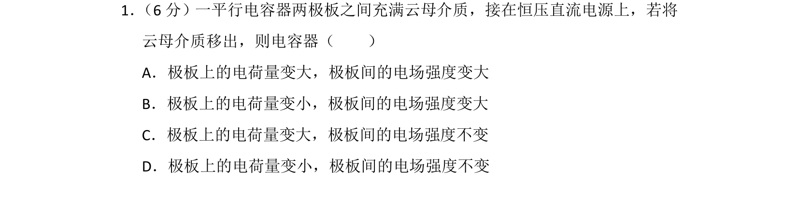
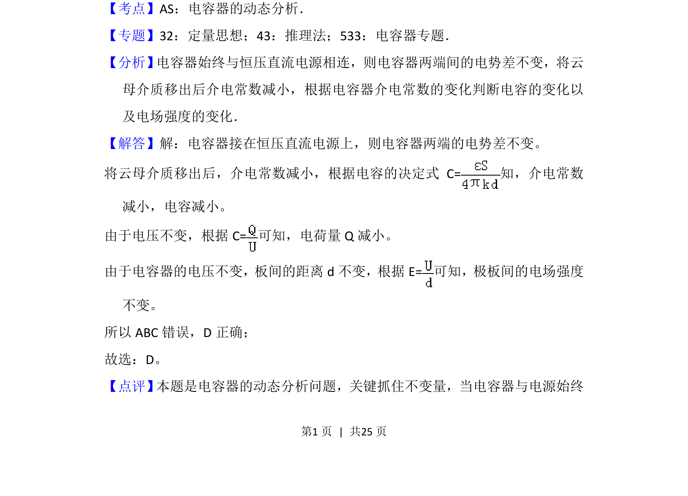
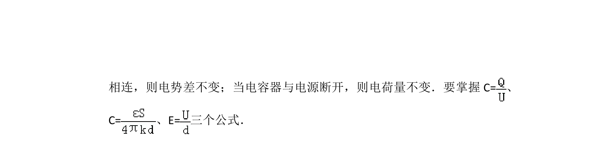

## 题面

## 摘要

电容器接恒压电源，移出介质后，由介电常数减小导致电容和电荷量减小，电场强度不变。

## 关联考点

- [[865-电容器的动态分析|电容器的动态分析]]
- [[电容的决定式]]
- [[匀强电场电场强度与电势差的关系]]

## 答案与解析

> 📄 原 PDF 第 1 页：`素材/真题/湖南/2008-2024·（湖南）物理高考真题/2016年高考物理试卷（新课标Ⅰ）（解析卷）.pdf`
