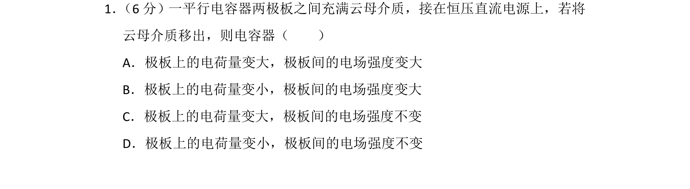
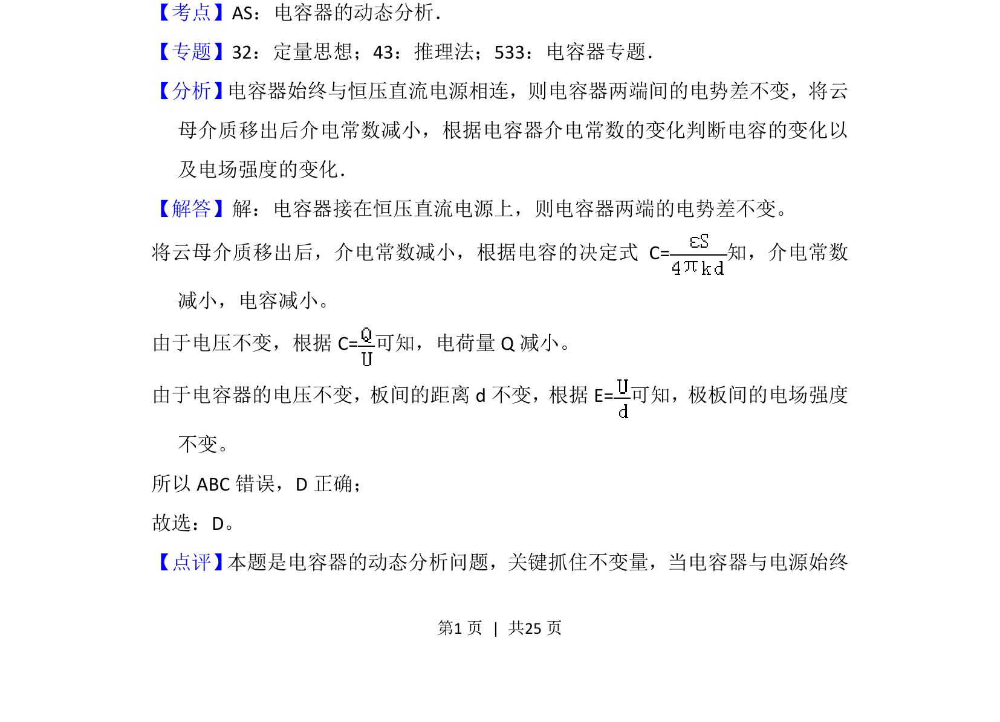
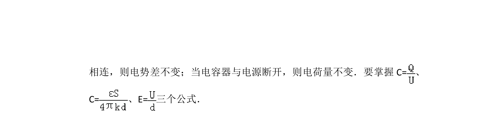

## 题面

## 摘要

电容器接恒压电源，移出介质后，由介电常数减小导致电容和电荷量减小，电场强度不变。

## 关联考点

- [[865-电容器的动态分析|电容器的动态分析]]
- [[电容的决定式]]
- [[匀强电场电场强度与电势差的关系]]

## 答案与解析

> 📄 原 PDF 第 1 页：`素材/真题/湖南/2008-2024·（湖南）物理高考真题/2016年高考物理试卷（新课标Ⅰ）（解析卷）.pdf`

<!-- 题干文本-start -->
## 题干文本
1． （6分）一平行电容器两极板之间充满云母介质，接在恒压直流电源上，若将
云母介质移出，则电容器（　　）
A．极板上的电荷量变大，极板间的电场强度变大
B．极板上的电荷量变小，极板间的电场强度变大
C．极板上的电荷量变大，极板间的电场强度不变
D．极板上的电荷量变小，极板间的电场强度不变
<!-- 题干文本-end -->

<!-- 解析文本-start -->
## 解析文本
【考点】AS：电容器的动态分析．菁优网版权所有
【专题】32：定量思想；43：推理法；533：电容器专题．
【分析】 电容器始终与恒压直流电源相连，则电容器两端间的电势差不变，将云
母介质移出后介电常数减小，根据电容器介电常数的变化判断电容的变化以
及电场强度的变化．
【解答】解：电容器接在恒压直流电源上，则电容器两端的电势差不变。
将云母介质移出后，介电常数减小，根据电容的决定式 C=知，介电常数
减小，电容减小。
由于电压不变，根据C=可知，电荷量Q减小。
由于电容器的电压不变，板间的距离d不变，根据E=可知，极板间的电场强度
不变。
所以ABC错误，D正确；
故选：D。
【点评】 本题是电容器的动态分析问题，关键抓住不变量，当电容器与电源始终
<!-- 解析文本-end -->
