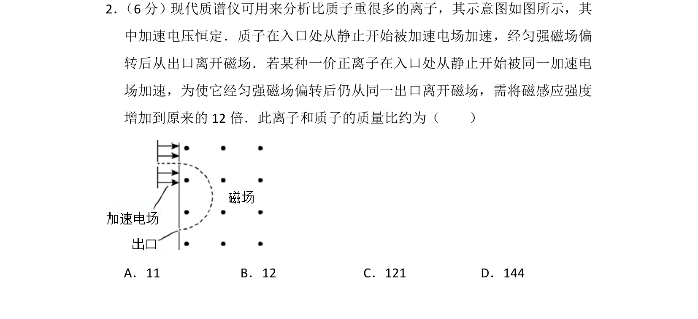
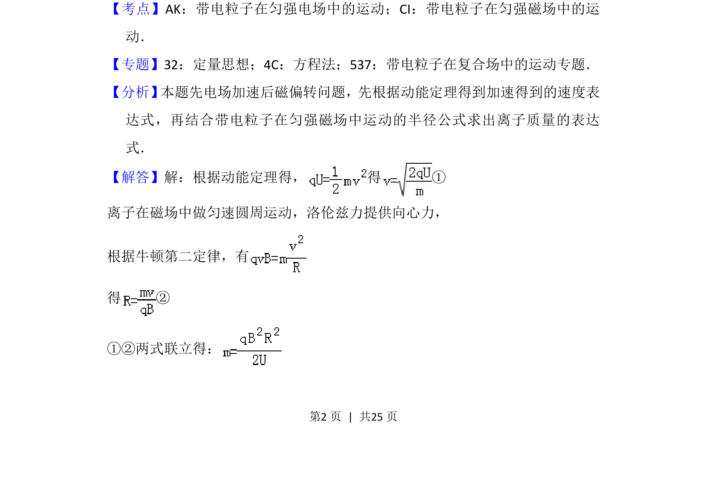
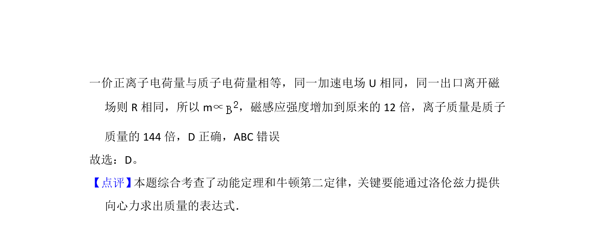

## 题面

## 摘要

质谱仪中离子经电场加速后磁场偏转，由出口位置不变推求离子与质子质量比

## 关联考点

- [[800-带电粒子在电场中的运动|带电粒子在电场中的运动]]
- [[469-带电粒子在磁场中的运动|带电粒子在磁场中的运动]]
- [[251-动能定理|动能定理]]
- [[229-牛顿第二定律|牛顿第二定律]]

## 答案与解析

> 📄 原 PDF 第 2 页：`素材/真题/湖南/2008-2024·（湖南）物理高考真题/2016年高考物理试卷（新课标Ⅰ）（解析卷）.pdf`
