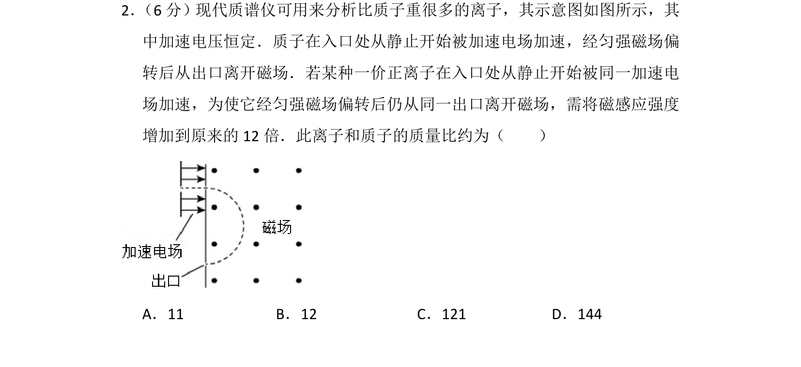
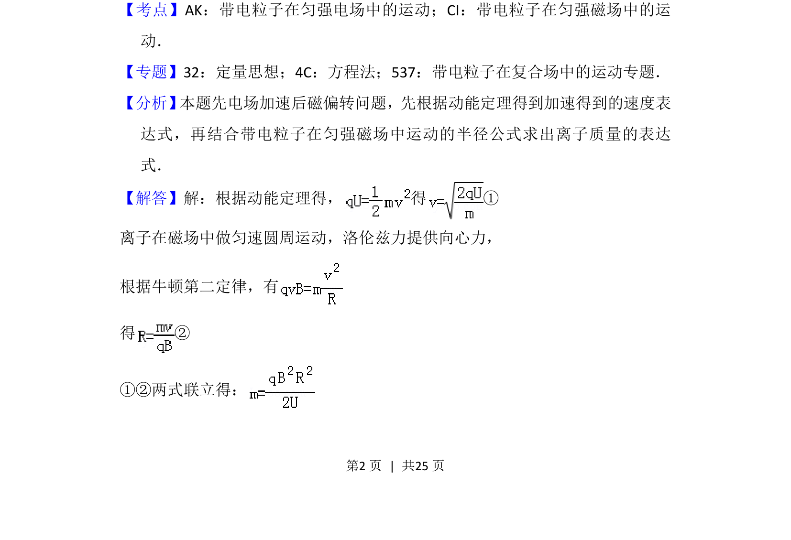
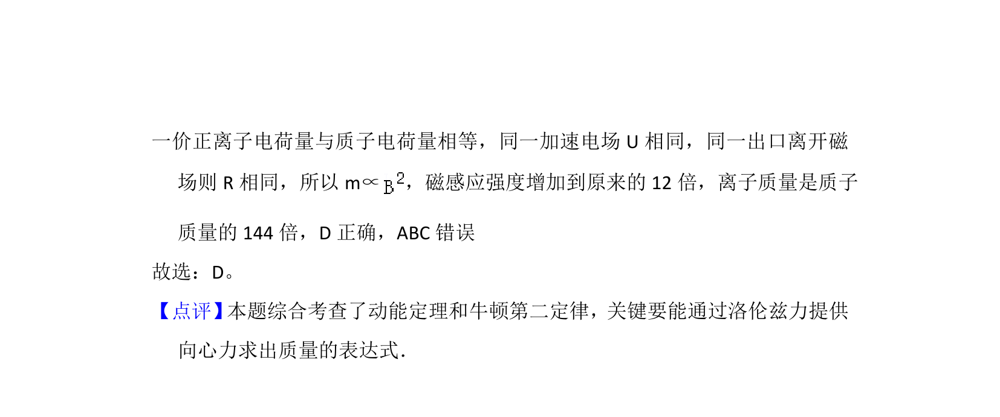

## 题面

## 摘要

质谱仪中离子经电场加速后磁场偏转，由出口位置不变推求离子与质子质量比

## 关联考点

- [[800-带电粒子在电场中的运动|带电粒子在电场中的运动]]
- [[469-带电粒子在磁场中的运动|带电粒子在磁场中的运动]]
- [[251-动能定理|动能定理]]
- [[229-牛顿第二定律|牛顿第二定律]]

## 答案与解析

> 📄 原 PDF 第 2 页：`素材/真题/湖南/2008-2024·（湖南）物理高考真题/2016年高考物理试卷（新课标Ⅰ）（解析卷）.pdf`

<!-- 题干文本-start -->
## 题干文本
2． （6分）现代质谱仪可用来分析比质子重很多的离子，其示意图如图所示，其
中加速电压恒定．质子在入口处从静止开始被加速电场加速，经匀强磁场偏
转后从出口离开磁场．若某种一价正离子在入口处从静止开始被同一加速电
场加速，为使它经匀强磁场偏转后仍从同一出口离开磁场，需将磁感应强度
增加到原来的12倍．此离子和质子的质量比约为（　　）
A．11 B．12 C．121 D．144
<!-- 题干文本-end -->

<!-- 解析文本-start -->
## 解析文本
【考点】AK：带电粒子在匀强电场中的运动；CI：带电粒子在匀强磁场中的运
动．菁优网版权所有
【专题】32：定量思想；4C：方程法；537：带电粒子在复合场中的运动专题．
【分析】 本题先电场加速后磁偏转问题，先根据动能定理得到加速得到的速度表
达式，再结合带电粒子在匀强磁场中运动的半径公式求出离子质量的表达
式．
【解答】解：根据动能定理得， 得 ①
离子在磁场中做匀速圆周运动，洛伦兹力提供向心力，
根据牛顿第二定律，有
得 ②
①②两式联立得：
<!-- 解析文本-end -->
