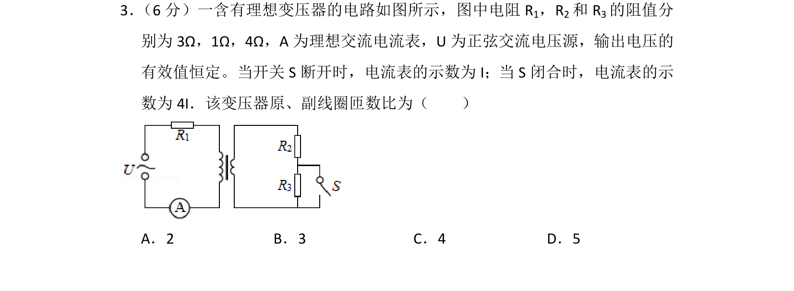
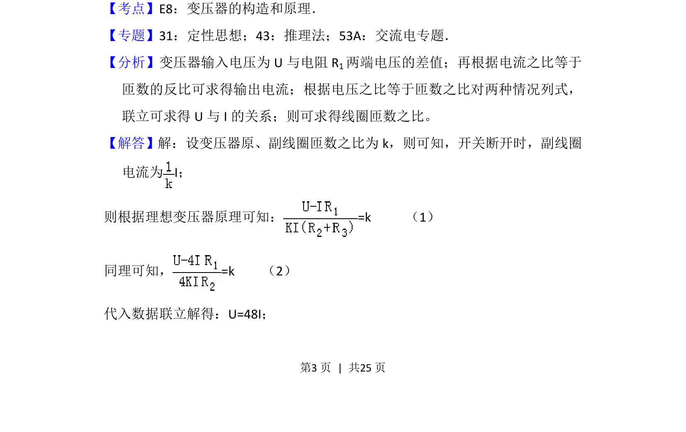
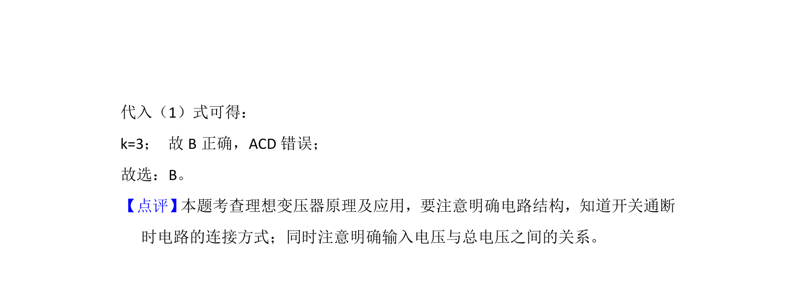

## 题面

## 摘要

考查理想变压器原线圈串电阻，开关切换时利用电压、电流与匝数比关系列方程求解匝数比。

## 关联考点

- [[398-理想变压器|理想变压器]]
- [[匝数比]]
- [[电压电流关系]]
- [[693-电路分析|电路分析]]

## 答案与解析

> 📄 原 PDF 第 3 页：`素材/真题/湖南/2008-2024·（湖南）物理高考真题/2016年高考物理试卷（新课标Ⅰ）（解析卷）.pdf`

<!-- 题干文本-start -->
## 题干文本
3． （6分）一含有理想变压器的电路如图所示，图中电阻R1，R2和R 3的阻值分
别为3Ω，1Ω，4Ω，A为理想交流电流表，U为正弦交流电压源，输出电压的
有效值恒定。当开关S断开时，电流表的示数为I；当S闭合时，电流表的示
数为4I．该变压器原、副线圈匝数比为（　　）
A．2 B．3 C．4 D．5
<!-- 题干文本-end -->

<!-- 解析文本-start -->
## 解析文本
【考点】E8：变压器的构造和原理．菁优网版权所有
【专题】31：定性思想；43：推理法；53A：交流电专题．
【分析】变压器输入电压为U与电阻R 1两端电压的差值；再根据电流之比等于
匝数的反比可求得输出电流；根据电压之比等于匝数之比对两种情况列式，
联立可求得U与I的关系；则可求得线圈匝数之比。
【解答】解：设变压器原、副线圈匝数之比为k，则可知，开关断开时，副线圈
电流为I；
则根据理想变压器原理可知：=k     （1）
同理可知，=k    （2）
代入数据联立解得：U=48I；
<!-- 解析文本-end -->
