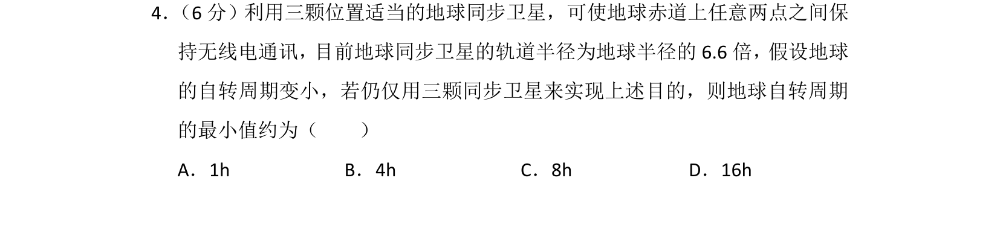
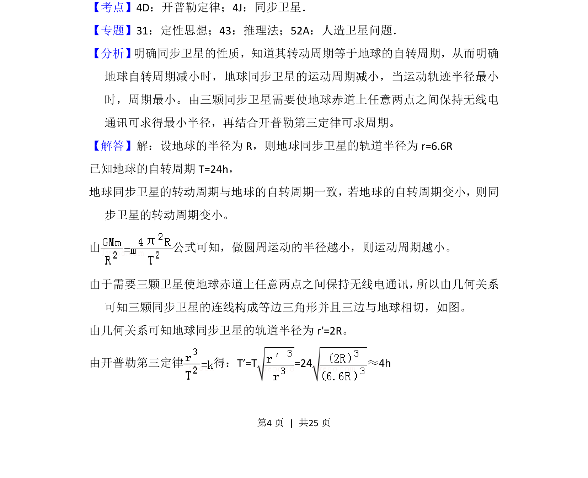
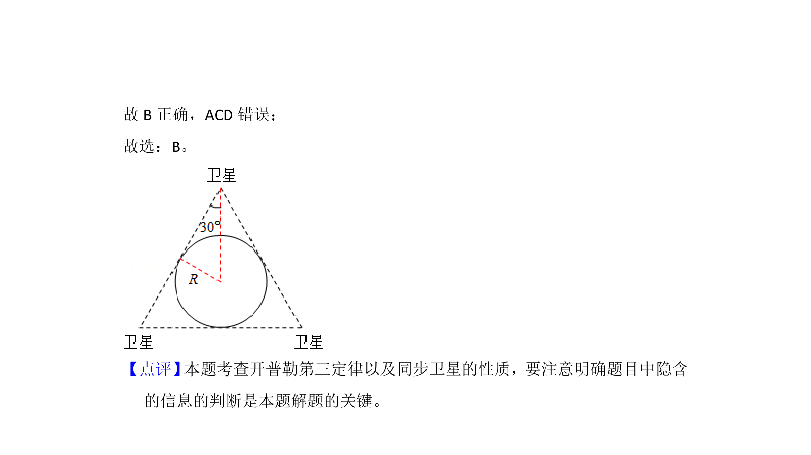

## 题面

## 摘要

通过几何约束与开普勒定律求解地球自转周期最小值

## 关联考点

- [[560-同步卫星|同步卫星]]
- [[266-开普勒第三定律|开普勒第三定律]]
- [[866-轨道半径|轨道半径]]
- [[261-周期|周期]]

## 答案与解析

> 📄 原 PDF 第 4 页：`素材/真题/湖南/2008-2024·（湖南）物理高考真题/2016年高考物理试卷（新课标Ⅰ）（解析卷）.pdf`
